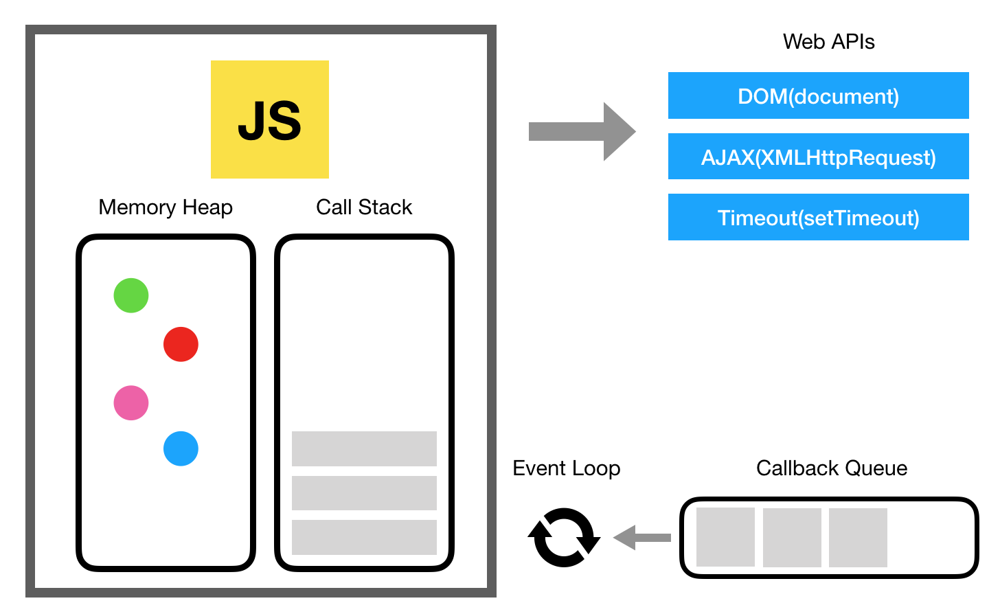
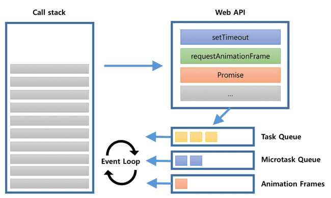

# JavaScript에서 동기와 비동기(작동원리)

자바스크립트는 `동기적`이다

콜스택이 하나임 → 실행될 코드를 한 줄 단위로 할당 ([인터프리터](../개발상식/인터프리터언어_컴파일언어.md))

근데…함수가 다 받아지는 걸 기다리다가는 사용자에게 화면이 보여지는 시점이 언제일지 모름.

콜스택이 하나인데 어떻게 비동기를 사용?

Web APIs가 그걸 가능하게 해줌

콜백 큐 → 비동기 처리가 끝난 후 실행되어야 할 콜백 함수가 차례로 할당된다.

이벤트 루프가 call stack을 검사하면서 비어있을 때 callback Queue에 있는 애를 보내줌

: 동기 함수가 다 끝나야 비동기 함수가 실행됨

 

*setTimeout보다 Promise가 우선순위

Microtask Queue (Promise) > Animation Frames > Task Queue (setTimeout)

 
 

👉👉자세한 내용은 동영상 강의 참고!!

[[이벤트 루프(1/2)] JS로 개발하는데 내부 동작을 모르면 곤란합니다 | 코드 실행 과정 - YouTube](https://www.youtube.com/watch?v=QFHyPInNhbo)

[[이벤트 루프(2/2)] 여러분은 이제 JS를 알게 됐습니다 | ㅊㅋㅊㅋ💕🎉 - YouTube](https://www.youtube.com/watch?v=S1bVARd2OSE)
