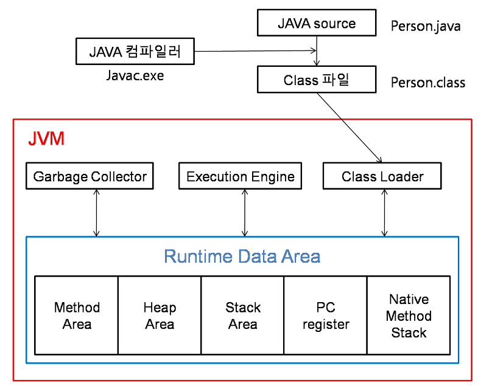

## Object Oriented Programming(OOP)

### OOP가 나오게 된 배경

정의한 기능의 흐름에 따라 **순서대로 동작을 추가하며 프로그램을 완성**하는 방식이다. 

간단한 프로그램의 경우, 이렇게 코드를 짜게 되면 **흐름이 눈으로 보이기 때문에 매우 직관적**일 것이다. 그러나, 조금이라도 프로그램의 규모가 커지게 되면 곤란해진다. 만일 A → B → C 라는 동작을 구현하다가, C 에서 A 로 돌아가야할 상황이라면 `goto` 를 활용해야 한다.

`goto` 문을 무분별하게 활용하게 되면, 그야말로 **스파게티 그 자체가 완성**된다. 쭉 나열된 코드 속에서 위로 갔다가 아래로 갔다가 난리도 아니게 된다. 그렇게 되면 **동작이 직관적이지 못하게 되고**, 유일한 장점이 사라지는 셈이다.

그래서 등장한 것이 **절차적, 구조적** 프로그래밍이다.

<br>

### 절차적 (구조적) 프로그래밍

절차적 프로그래밍에서 **'절차'는 함수를 의미**한다. 따라서 절차적 프로그래밍이란, **반복되는 동작을 함수 및 프로시저(리턴값이 없는 함수)형태로 모듈화하여 사용**하는 방식이다.

-> 프로시저 자체가 추상적

예를들어,

도서관의 도서 관리 프로그램을 개발한다고 하자.

- **'책'이라는 자료형을 구현해야 함**
- **책에 대한 함수를 구현해야 함**

그러나, 구조적 프로그래밍에서는 이 둘을 따로 생각할 수 밖에 없다. **책은 책이고 책에 관한 함수는 따로 있기** 때문에, 같은 소스코드 파일 내에 있더라도 이 **둘의 연관 여부는 단 번에 알아차리기 어렵다**. 즉, **논리적으로 묶여있을 수 없는 구조이기 때문에 동작이 추상적**인 것이다.

따라서, 이를 묶기 위한 패러다임으로 '객체지향 프로그래밍' 이 등장하게 된 것이다.


### 객체 지향 프로그래밍?

 [컴퓨터 프로그래밍](https://ko.wikipedia.org/wiki/컴퓨터_프로그래밍)의 [패러다임](https://ko.wikipedia.org/wiki/패러다임) 중 하나. 어떤 개념에 대한 자료형과 함수를 **'객체' 형태로 함께 묶어서 관리**하기 위해 **객체지향 프로그래밍 패러다임**

`point!` **객체 내부에 자료형 필드와 함수가 함께 존재**하는 것이다. 가능한 모든 물리적, 논리적 요소를 객체로 만드는 것이 객체지향 프로그래밍이다.

 [컴퓨터 프로그램](https://ko.wikipedia.org/wiki/컴퓨터_프로그램)을 [명령어](https://ko.wikipedia.org/wiki/명령어_(컴퓨팅))의 목록으로 보는 시각에서 벗어나 여러 개의 독립된 단위, 즉 "[객체](https://ko.wikipedia.org/wiki/객체_(컴퓨터_과학))"들의 모임으로 파악하고자 하는 것 - 각각의 객체는 [메시지](https://ko.wikipedia.org/wiki/메시지)를 주고받고, [데이터](https://ko.wikipedia.org/wiki/데이터)를 처리할 수 있다.


##### OOP 로 코드를 작성하면?

- 이미 작성한 코드에 대한 재사용성이 높다. 자주 사용되는 로직을 라이브러리로 만들어두면 계속해서 사용할 수 있으며 그 신뢰성을 확보 할 수 있다.
- 라이브러리를 각종 예외상황에 맞게 잘 만들어두면 개발자가 사소한 실수를 하더라도 그 에러를 컴파일 단계에서 잡아낼 수 있으므로 버그 발생이 줄어든다.
- 객체 단위로 코드가 나눠져 작성되기 때문에 디버깅이 쉽고 유지보수에 용이하다.
- 데이터 모델링을 할 때 객체와 매핑하는 것이 수월하기 때문에 요구사항을 보다 명확하게 파악하여 프로그래밍 할 수 있다.
- 프로그램을 유연하고 변경이 쉽게 만들기 때문에 대규모 [소프트웨어 개발](https://ko.wikipedia.org/wiki/소프트웨어_개발)에 많이 사용된다. 
- 또한 프로그래밍을 더 배우기 쉽게 하고 소프트웨어 개발과 보수를 간편하게 하며, 보다 직관적인 [코드](https://ko.wikipedia.org/wiki/소스_코드) 분석을 가능하게 하는 장점이 있다. 

그러나, 지나친 프로그램의 객체화 경향은 실제 세계의 모습을 그대로 반영하지 못한다는 비판을 받기도 한다.

<br>

### 객체 지향적 설계 원칙

1. SRP(Single Responsibility Principle) : `단일 책임 원칙`
   클래스는 단 하나의 책임을 가져야 하며 클래스를 변경하는 이유는 단 하나의 이유이어야 한다.

   예를 들어, A라는 로직이 있다면 어떤 클래스는 A에 관한 클래스여야하고 이를 수정해도 A와 관련된 수정이어야 한다.

2. OCP(Open-Closed Principle) : `개방-폐쇄 원칙`
   유지 보수 상황이 생긴다면 코드를 쉽게 확장할 수 있도록 하고 수정할때는 닫혀 있어야 하는 원칙.

   기존의 코드는 잘 변경하지 않으면서도 확장은 쉽게 할 수 있어야 한다.

3. LSP(Liskov Substitution Principle) : `리스코프 치환 원칙`
   상위 타입의 객체를 하위 타입의 객체로 치환해도 상위 타입을 사용하는 프로그램은 정상적으로 동작해야 한다.

4. ISP(Interface Segregation Principle) : `인터페이스 분리 원칙`
   하나의 일반적인 인터페이스보다 구체적인 여러개의 인터페이스를 만들어야 하는 원칙

5. DIP(Dependency Inversion Principle) : `의존 역전 원칙`
   고수준 모듈은 저수준 모듈의 구현에 의존해서는 안된다.

   예를 들어, 타이어를 갈아끼울 수 있는 틀을 만들어 놓은 뒤 다양한 타이어를 교체할 수 있어야 한다.

   즉 상위 계층은 하위 계층에 변화에 대한 구현으로 부터 독립적이여야 한다.

<br>

### 기본 구성 요소

- `클래스(Class)` - 같은 종류(또는 문제 해결을 위한)의 집단에 속하는 속성(attribute)과 행위(behavior)를 정의한 것으로 객체지향 프로그램의 기본적인 사용자 정의 데이터형(user defined data type)이라고 할 수 있다. 클래스는 다른 클래스 또는 외부 요소와 독립적으로 디자인하여야 한다. 
- `객체(Object)` - 클래스의 인스턴스(실제로 메모리상에 할당된 것)이다. 객체는 자신 고유의 속성(attribute)을 가지며 클래스에서 정의한 행위(behavior)를 수행할 수 있다. 객체의 행위는 클래스에 정의된 행위에 대한 정의를 공유함으로써 메모리를 경제적으로 사용한다.
- `메서드(Method), 메시지(Message) `- 클래스로부터 생성된 객체를 사용하는 방법으로서 객체에 명령을 내리는 메시지라 할 수 있다. 메서드는 한 객체의 서브루틴(subroutine) 형태로 객체의 속성을 조작하는 데 사용된다. 또 객체 간의 통신은 메시지를 통해 이루어진다.

<br>

### 객체지향 프로그래밍의 4가지 특성

#### 1. 추상화 (Abstraction)

추상화란 복잡한 시스템으로부터 핵심적인 개념 또는 기능을 간추려내는 것을 의미한다.

예를 들어, 

- 김싸피에게는 SSAFY, Vote24, 도와주개냥, JTDA, 취준생 등의 특징이 있으면 이중 코드로 나타낼 때, SSAFY, 취준생의 특징만 뽑아내거나 간추려서 나타내는 것을 말함.
- '평생 못 사는 자동차'라는 추상화 집합을 만들어두고, 평생 못 사는 자동차들이 가진 공통적인 특징들 (매우 비쌈, 빵빵한 배기음 등) 을 만들어 활용하면 된다.

<br>

#### 2. 캡슐화 (Encapsulation)

캡슐화는 객체의 속성과 메서드를 하나로 묶고 일부를 외부에 감추어 은닉하는 것을 의미한다.

쉽게 말하면, **한 곳에서 변화가 일어나도 다른 곳에 미치는 사이드 이펙트를 최소화** 시키는 것을 의미한다. 

즉, 객체 내부의 **어떤 동작에 대한 구현이 어떻게 되어있는지 감추는 것**이다. 이를 통해 외부에서 뭔가 잘못 건드려 객체를 손상시키는 일을 방지할 수 있다.

**`결합도`란 어떤 기능을 실행할 때 다른 클래스나 모듈에 얼마나 의존적인지**를 나타내는 지표이다. 객체 간의 독립성을 강조하기 위해 **의존도가 최대한 낮게 만드는 것이 중요**하다.

 때문에 소프트웨어 공학적으로, **객체 내의 모듈 간의 요소가 밀접한 관련이 있는 것으로 구성하여 응집도를 높이고**, **결합도를 줄여야 요구사항 변경에 대처하는 좋은 설계**라고 배운다.

##### 방법

정보 **은닉화를 통해 `높은 응집도, 낮은 결합도`를 유지**할 수 있도록 설계한다.
외부에서 접근할 필요 없는 것들은 접근 지정자를 **`private` 으로 두어 접근에 제한**을 두는 것이다. 

외부 객체는 객체 내부의 구조를 모르게 하고, 해당 객체가 노출해서 제공하는 필드와 메소드만 이용할 수 있도록 하여 의도하지 않은 동작 오류를 방지하고 유지보수 효율을 높일 수 있다.

<br>

#### 3. 상속성

상속성은 상위 클래스의 특성을 하위 클래스가 이어받아서 재사용하거나 추가, 확장하는 것을 말한다.

코드의 재사용 측면, 계층적인 관계 생성, 유지 보수성 측면에서 중요하다.

여러 개체들이 지닌 **공통된 특성을 부각시켜 하나의 개념이나 법칙으로 성립**하는 과정 (일반화)

상속은 **자식 클래스를 외부로부터 은닉**하는 **캡슐화의 일종**이다.

'평생 못 사는 차'를 통해 추상화를 설명했었는데, 조금 더 나아가 **'쌉부자' 클래스**가 있다고 가정해보자. 

이 때, **평생 못 사는 자동차의 자식 클래스에 해당하는 람보르기니, 페라리, 맥라렌 등은 캡슐화를 통해 은닉해둔 상태**이다. **쌉부자의 관점**으로는, 구체적인 **자동차 종류가 숨겨져 있는 상태**다. 자동차를 수집하고 싶은 쌉부자 입장에서는 자동차 **종류가 어떤 것이든, 구매하는 데에 크게 중요하지 않다**. 그냥 남들이 평생 못 사는 자동차면 된다. 그 어떤 **값비싼 차가 추가**된다고 해도, **쌉부자에겐 영향이 없어야 한다는 점이 가장 중요**하다. 따라서 **캡슐화를 통해 쌉부자 입장에선 확인할 수 없도록** 하는 것이다.

이처럼, 상속 관계에서는 단순히 하나의 클래스 안에서 **속성, 메소드들의 캡슐화에 한정되지 않는다**. 

즉 **자식 클래스 또한 캡슐화되어 '쌉부자'와 같은 외부 클래스에 은닉**하는 것으로 확장되는 것이다.

이렇듯 **자식 클래스를 캡슐화**해두면, **외부에선 개별적인 자식 클래스들과 무관하게 개발을 이어갈 수 있는 장점**이 있다.

<br>

### 4. 다형성 (Polymorphism)

다형성은 하나의 메서드나 클래스가 다양한 방법으로 동작하는 것을 말한다. 

서로 다른 클래스의 객체가 같은 동작 수행 명령을 받았을 때, **각자의 특성에 맞는 방식으로 동작**하는 것.

객체지향 패러다임의 핵심이다. **다형성은 상속과의 시너지가 엄청나다**. 다형성 구현을 통해 **코드를 간결하게 해주고, 유연함을 갖추게** 해준다. 또한, 구체적으로 현재 어떤 클래스 객체가 참조되는 지는 무관하게 **헐렁하게 프로그래밍하는 것이 가능**하다.

<br>

평생 못 사는 차들은 배기음이 각기 다르고 고유의 감성이 있어 자동차 덕후들에게 사랑받는다. 위 예시에서 '평생 못 사는차'라는 개념을 일반화(상속)하여 **람보르기니, 페라리** 등의 객체를 만들었는데, **평생 못 사는 차라는 클래스의 '배기음 출력' 이라는 메소드를 실행**했을 때, **자식 클래스들이 각기다른 배기음을 내뿜는 것이 다형성이 부각된 부분**이다.


<hr>

### 예상 질문

Q. OOP의 장점은?

소프트웨어 공학의 관점에서 볼 때 S/W의 질을 향상하기 위해 강한 응집력(Strong Cohesion)과 약한 결합력(Weak Coupling)을 지향해야 하는데, OOP의 경우 하나의 문제 해결을 위한 데이터를 클래스에 모아 놓은 데이터형을 사용함으로써 응집력을 강화하고, 클래스간에 독립적인 디자인을 함으로써 결합력을 약하게 한다.

Q. oop의 특징 4가지

추상화, 캡슐화, 상속성, 다형성


<hr>

참고자료

- 위키백과
- https://velog.io/@haero_kim/%EA%B0%9D%EC%B2%B4%EC%A7%80%ED%96%A5-%ED%94%84%EB%A1%9C%EA%B7%B8%EB%9E%98%EB%B0%8D-%EC%9D%B4%ED%95%B4%ED%95%98%EA%B8%B0


------


# RESTful API


### REST란?

------

Representational State Transfer의 약자로 로이 필딩에 의해 최초로 소개

HTTP를 효과적으로 사용할 수 있게 하는 아키텍처


간단히 말해서 url과 http메소드를 이용해 객체화된 서비스에 접근하는 것  -  효정

REST 는 말하자면 Resource Oriented Architecture 로, API 설계의 중심에 자원(Resource)이 있고, HTTP Method 를 통해 자원을 처리하도록 설계하는 것.  - 지후

------


### REST의 구성

------

자원(Resource) - URI

행위(Verb) - HTTP METHOD

표현(Representations) - HTTP Message Pay Load

------


### REST의 특징 (대표적 6가지)

------

1. Uniform Interface(인터페이스 일관성)
   - URI로 지정한 리소스에 대한 조작을 통일되고 한정적인 인터페이스로 수행한다.
   - HTTP 표준 프로토콜에 따르는 모든 플랫폼에서 사용이 가능하다.
2. Stateless(무상태성)
   - HTTP 프로토롤은 Stateless Protocol 이므로 REST 역시 무상태성을 갖는다.
   - Client의 context를 Server에 저장하지 않는다. 즉, 세션이나 쿠키 정보를 저장, 관리하지 않는다.
   - Server는 각각의 요청을 완전히 별개의 것으로 인식하고 처리한다.
     - 각 API 서버는 Client의 요청만을 단순 처리
     - 이전 요청이 다음 요청의 처리에 연관되지 않는다.
     - Server 처리방식에 일관성을 부여하고 부담이 줄어들며 서비스의 자유도가 높아진다.
3. Cacheable (캐시 처리 가능)
   - HTTP 프로토콜을 그대로 사용하여 웹에서 사용하는 기존의 인프라를 그대로 활용 할 수 있다.
     - 따라서, HTTP의 특징인 캐싱기능을 그대로 사용할 수 있다.
     - HTTP 프로토콜 표준에서 사용하는 Last-Modified태그나 E-Tag를 이용하면 캐싱 구현이 가능하다.
4. Self-descriptiveness (자체 표현 구조)
   - REST API 메시지만 보고도 이를 쉽게 이해할 수 있는 자체 표현 구조로 되어 있다.
     - ex) POST /photos : 새 사진 생성
5. Client-Server 구조
   - REST Server : API 제공, 비지니스 로직 처리 및 저장
   - Client : 사용자 인증이나 컨텍스트(세션, 로그인 정보) 등을 직접 관리
   - 각각의 역할을 확실히 구분하여 서로간의 의존성이 줄어든다.
6. Layered System (계층형 구조)
   - REST 서버는 다중 계층으로 구성될 수 있다.
   - 보안, 로드밸런싱, 암호화, 사용자 인증 등을 추가해 구조상의 유연성을 둘수 있다.
   - PROXY, 게이트웨이 같은 네트워크 기반의 중간매체를 사용할 수 있다.

------


### REST API 디자인 가이드

------

**첫 번째, URI는 정보의 자원을 표현해야한다.**

**두 번째, 자원에 대한 행위는 HTTP Method(GET, POST, PUT, DELETE)로 표현한다.**


#### HTTP METHOD의 알맞은 역할

| METHOD | 역할                                       |
| ------ | ---------------------------------------- |
| POST   | POST를 통해 해당 URI를 요청하면 리소스를 생성합니다.        |
| GET    | GET를 통해 해당 리소스를 조회합니다. 리소스를 조회하고 해당 도큐먼트에 대한 자세한 정보를 가져온다. |
| PUT    | PUT를 통해 해당 리소스를 수정합니다.                   |
| DELETE | DELETE를 통해 리소스를 삭제합니다.                   |

※ 이외에도 PATCH 라는 HTTP Method 가 있다. 최근 update 이벤트에서 PUT보다 적합하다는 평가를 받는중.

- `PUT` : 자원 **전체** 교체 (자원의 모든 필드 필요)

- `PATCH` : 자원의 **부분** 교체 (자원의 일부 필드 필요)

  ​

#### URI 설계 예

| HTTP Verb | Path             | action  | used for                                 |
| --------- | ---------------- | ------- | ---------------------------------------- |
| GET       | /photos          | index   | display a list of all photos             |
| GET       | /photos/new      | new     | return an HTML form for creating a new photo |
| POST      | /photos          | create  | create a new photo                       |
| GET       | /photos/:id      | show    | display a specific photo                 |
| GET       | /photos/:id/edit | edit    | return an HTML form for editing a photo  |
| PUT       | /photos/:id      | update  | update a specific photo                  |
| DELETE    | /photos/:id      | destroy | delete a specific photo                  |

입력 Form은?

Form 자체도 정보로 취급하여 GET 요청으로 가져온다.


#### URI 설계 시 주의할 점

1. 슬래시 구분자(/)는 계층 관계를 나타내는 데 사용

   ```
   http://restapi.example.com/houses/apartments
   http://restapi.example.com/animals/mammals/whales
   ```


1. URI 마지막 문자로 슬래시(/)를 포함하지 않는다.
2. 하이픈(-)은 URI 가독성을 높이는데 사용
3. 밑줄(_)은 URI에 사용하지 않는다.
4. URI 경로에는 소문자가 적합하다.
5. 파일 확장자는 URI에 포함시키지 않는다.

#### 리소스 간의 관계를 표현하는 방법

REST 리소스 간에는 연관 관계가 있을 수 있고, 이런 경우 다음과 같은 표현방법으로 사용합니다.

```
    /리소스명/리소스 ID/관계가 있는 다른 리소스명
    ex)    GET : /users/{userid}/devices (일반적으로 소유 ‘has’의 관계를 표현할 때)
```

만약에 관계명이 복잡하다면 이를 서브 리소스에 명시적으로 표현하는 방법이 있습니다. 예를 들어 사용자가 ‘좋아하는’ 디바이스 목록을 표현해야 할 경우 다음과 같은 형태로 사용될 수 있습니다.

```
    GET : /users/{userid}/likes/devices (관계명이 애매하거나 구체적 표현이 필요할 때)
```


#### 자원을 표현하는 Collection과 Document

- Collection은 문서들의 집합, 객체들의 집합
- Document는 문서, 하나의 객체

| Resource   | GET                                     | PUT                        | POST                                     | DELETE                |
| ---------- | --------------------------------------- | -------------------------- | ---------------------------------------- | --------------------- |
| Collection | 컬렉션에 속한 자원들의 URI나 그 상세사항의 **목록**을 보여준다. | 전체 컬렉션은 다른 컬렉션으로 **교체**한다. | 해당 컬렉션에 속하는 새로운 자원을 **생성**한다. 자원의 URI는 시스템에 의해 할당된다. | 전체 컬렉션을 **삭제**한다.     |
| Document   | 요청한 컬렉션 내 자원을 **반환**한다.                 | 해당 자원을 **수정**한다.           | 해당 자원에 귀속되는 새로운 자원을 **생성**한다.            | 해당 컬렉션내 자원을 **삭제**한다. |

------


### HTTP 응답 상태 코드

------

잘 설계된 REST API는 URI만 잘 설계된 것이 아닌 리소스에 대한 응답을 잘 내어주는 것 까지 포함되어야 합니다. 정확한 응답의 상태코드만으로도 많은 정보를 전달할 수가 있기 때문에 응답의 상태코드를 명확히 돌려주어야 합니다.

#### 대표적인 상태코드

| 상태코드 |                                          |
| ---- | ---------------------------------------- |
| 200  | 클라이언트의 요청을 정상적으로 수행함                     |
| 201  | 클라이언트가 어떠한 리소스 생성을 요청, 해당 리소스가 성공적으로 생성됨(POST를 통한 리소스 생성 작업 시) |

| 상태코드 |                                          |
| ---- | ---------------------------------------- |
| 400  | 클라이언트의 요청이 부적절 할 경우 사용하는 응답 코드           |
| 401  | 클라이언트가 인증되지 않은 상태에서 보호된 리소스를 요청했을 때 사용하는 응답 코드 |
|      | (로그인 하지 않은 유저가 로그인 했을 때, 요청 가능한 리소스를 요청했을 때) |
| 403  | 유저 인증상태와 관계 없이 응답하고 싶지 않은 리소스를 클라이언트가 요청했을 때 사용하는 응답 코드 |
|      | (403 보다는 400이나 404를 사용할 것을 권고. 403 자체가 리소스가 존재한다는 뜻이기 때문에) |
| 405  | 클라이언트가 요청한 리소스에서는 사용 불가능한 Method를 이용했을 경우 사용하는 응답 코드 |

| 상태코드 |                                          |
| ---- | ---------------------------------------- |
| 301  | 클라이언트가 요청한 리소스에 대한 URI가 변경 되었을 때 사용하는 응답 코드 |
|      | (응답 시 Location header에 변경된 URI를 적어 줘야 합니다.) |
| 500  | 서버에 문제가 있을 경우 사용하는 응답 코드                 |

------


### REST의 장단점

------


#### 장점

- HTTP 프로토콜의 인프라를 그대로 사용하므로 REST API 사용을 위한 별도의 인프라를 구출할 필요가 없다.
- HTTP 프로토콜의 표준을 최대한 활용하여 여러 추가적인 장점을 함께 가져갈 수 있게 해준다.
- HTTP 표준 프로토콜에 따르는 모든 플랫폼에서 사용이 가능하다.
- Hypermedia API의 기본을 충실히 지키면서 범용성을 보장한다.
- REST API 메시지가 의도하는 바를 명확하게 나타내므로 의도하는 바를 쉽게 파악할 수 있다.
- 여러 가지 서비스 디자인에서 생길 수 있는 문제를 최소화한다.
- 서버와 클라이언트의 역할을 명확하게 분리한다.

#### 단점

- 표준이 자체가 존재하지 않아 정의가 필요하다.
- 사용할 수 있는 메소드가 4가지밖에 없다.
- HTTP Method 형태가 제한적이다.
- 브라우저를 통해 테스트할 일이 많은 서비스라면 쉽게 고칠 수 있는 URL보다 Header 정보의 값을 처리해야 하므로 전문성이 요구된다.
- 구형 브라우저에서 호환이 되지 않아 지원해주지 못하는 동작이 많다.(익스폴로어)

------


### 그래서 RESTful API???

------

위에 서술한 REST의 설계 규칙을 잘 지켜서 설계된 API를 RESTful 한 API라고 한다.

------


# TDD

### TDD란 무엇인가?

**Test-Driven Development** : 테스트 코드 주도 개발 방식.

매우 짧은 개발 사이클의 반복에 의존하는 소프트웨어 개발 프로세스.

요구되는 새로운 기능에 대한 자동화된 테스트케이스를 작성하고 해당 테스트를 통과하는 가장 간단한 코드를 작성한다. 그 후 상황에 맞게 리팩토링하는 과정을 거친다. 

#### TDD의 목표는 잘 작동하는 깔끔한 코드!

##### Add a Test

새로운 기능을 추가하기 전 **테스트를 먼저 작성**한다. 이를 위해 해당 기능의 요구사항과 명세를 분명히 이해하고 있어야 한다. 이는 사용자 케이스와 사용자 스토리 등으로 이해할 수 있으며, 이는 개발자가 코드를 작성하기 전에 보다 요구사항에 집중할 수 있도록 도와준다. 이는 정말 중요한 부분이자 테스트 주도 개발이 주는 이점이라고 볼 수 있다.

##### Run all tests and see if new one fails

어떤 새로운 기능을 추가하면 잘 작동하던 기능이 제대로 작동하지 않는 경우가 발생할 수 있다. 더 위험한 경우는 개발자가 이를 미처 인지하지 못하는 경우이다. 이러한 경우를 방지하기 위해 테스트 코드를 작성하는 것이다. 새로운 기능을 추가할 때 테스트 코드를 작성함으로써, 새로운 기능이 제대로 작동함과 동시에 기존의 기능들이 잘 작동하는지 테스트를 통해 확인할 수 있는 것이다.

##### Refactor Code

코드량이 방대해지면서 리팩토링을 하게 된다. 이 때 테스트 주도 개발을 해왔다면, 테스트 코드가 그 중심을 잡아줄 수 있다. 큰 함수를 여러 함수로 나누는 과정에서 해당 기능이 오작동을 일으킬 수 있지만 간단히 테스트를 돌려봄으로써 이에 대한 안심을 하고 계속해서 리팩토링을 진행할 수 있다. 결과적으로 리팩토링 속도도 빨라지고 코드의 퀄리티도 그만큼 향상하게 되는 것이다. 코드 퀄리티 부분을 조금 상세히 들어가보면, 보다 객체지향적이고 확장 가능이 용이한 코드, 재설계의 시간을 단축시킬 수 있는 코드, 디버깅 시간이 단축되는 코드가 TDD와 함께 탄생하는 것이다. 


### ?

Q. 코드 생산성에 문제가 있지는 않나?

분명 코드량이 늘어난다. 코드 퀄리티보다 빠른 생산성이 요구되는 시점에서 TDD는 큰 걸림돌이 될 수 있다.


Q. 테스트 코드를 작성하기가 쉬운가?

진입장벽이 존재한다. 어떤 부분을, 어떻게 테스트 할지, 어떤 테스트 프레임워크를 사용할지 등에 대한 학습이 필요하고 익숙해지는데에도 시간이 걸린다. 팀원 전체가 익숙해져야 하는 것 또한 문제.


Q. 모든 상황에 대해서 테스트 코드를 작성할 수 있는가? 작성해야 하는가?

세상에는 다양한 사용자가 존재하며, 생각지도 못한 예외 케이스가 존재할 수 있다. 테스트 코드를 작성하는 데 주객이 전도하는 상황이 발생할 수 있다. 테스트 코드를 작성하기 위해 배보다 배꼽이 더 커지는 경우도 허다하다. 코드를 관리하는 것 또한 쉽지 않다.

모든 코드에 대해서 테스트 코드를 작성할 수 없으며 작성할 필요도 없다. 테스트 코드를 작성한다고 해서 버그가 발생하지 않는 것도 아니다.

애초에 **TDD는 100% coverage와 100% 무결성을 주장하지 않았다.**

------


### 단위 테스트 Vs. 통합 테스트

#### 단위 테스트

하나의 모듈을 기준으로 독립적으로 진행되는 **가장 작은 단위**의 테스트.

하나의 기능 또는 메소드로 이해할 수 있다. 어떤 기능이 실행되면 어떤 결과가 나온다 정도로 테스트를 진행.

#### 통합 테스트

모듈을 통합하는 과정에서 모듈 간의 호환성을 확인하기 위해 수행되는 테스트.

독립적인 기능에 대한 테스트가 아닌, 웹 페이지로부터 API를 호출하여 올바르게 동작하는 지를 확인하는 것이다.


### 단위 테스트를 작성해야 하는 이유

- 코드를 수정하거나 기능을 추가할 때 수시로 빠르게 검증할 수 있다.
- 리팩토링 시에 안정성을 확보할 수 있다.
- 개발 및 테스팅에 대한 시간과 비용을 절감할 수 있다.

#### 좋은 테스트의 특징 (FIRST)

**First**: 테스트는 빠르게 동작하여 자주 돌릴 수 있어야 한다.

**Independent**: 각각의 테스트는 **독립적**이며 서로 의존해서는 안된다.

**Repeatable**: 어느 환경에서도 반복 가능해야 한다.

**Self-Validating**: 테스트는 성공 또는 실패로 **bool 값으로 결과를 내어** 자체적으로 검증되어야 한다.

**Timely**: 테스트는 적시에 즉, 테스트하려는 실제 코드를 구현하기 직전에 구현해야 한다.


### TDD의 방법 및 순서

1. 다음 목표를 생각한다. (과도한 시간을 투자하지 않는다.)

2. 그 목표를 달성(실패)시키는 테스트 코드를 작성한다.

3. 그 테스트를 실행하여 실패시킨다. (RED)

4. 목적을 달성시키는 코드를 적는다. (깨끗함은 포기한다.)

5. 2에서 적은 테스트를 성공시킨다. (GREEN)

6. 테스트를 통과하는 상태에서 리팩토링한다.

7. 다시 1번으로 가서, 1~6번을 반복한다.

   

### 왜 테스트 코드를 먼저 작성해야 하죠?

- 깔끔한 코드를 작성할 수 있다.
- 장기적으로 개발 비용을 절감할 수 있다.
- 개발이 끝나면 테스트 코드를 작성하는 것은 매우 귀찮다. 실패 케이스면 더욱 그렇다.

TDD의 궁극적인 목표는 **깔끔한 코드**를 작성하는 것이다. 리팩토링 과정에서 중복된 코드들은 제거되고, 복잡한 코드들은 깔끔하게 정리된다. 

테스트 코드는 성공 케이스 뿐만 아니라 실패 케이스까지 작성해야 하기 때문에 작성해야 할 테스트의 개수는 해당 함수에서 발생 가능한 모든 경우들인 N이다. 그리고 그 중에서도 실패 테스트부터 작성해야 한다. 순차적으로 실패하는 테스트를 먼저 작성하고, 오직 테스트가 실패할 경우에만 새로운 코드를 작성해야 한다. 그리고 중복된 코드가 있으면 제거한다.


#### TDD 접근 방법

- 가짜로 구현하기: 최대한 빨리 테스트 통과를 위해 가짜 정답을 구현
- 삼각측량법: 값이 다른 여러 테스트를 작성하고 이를 일반화하여 정답 구현
- 명백하게 구현하기: 정답을 바로 구현

참고

https://mangkyu.tistory.com/182


------


# CS study : 01 Development Common Sense

> [Interview_Question_for_Beginner](https://github.com/JaeYeopHan/Interview_Question_for_Beginner)/**Development_common_sense**/

- 위 repository 를 읽고 정리한 글입니다. 

## 객체 지향 프로그래밍

### OOP?

> [# 객체 지향에 대한 이해 / 객체 지향적 설계](https://asfirstalways.tistory.com/177)
>
> 객체 지향의 가장 기본은 객체이며, 객체의 핵심은 기능을 제공하는 것이다. 실제로 객체를 정의할 때 사용하는 것은 객체가 제공해야 할 기능이며, 객체가 내부적으로 어떤 데이터를 갖고 있는 지로는 정의되지 않는다. 이러한 기능들을 **오퍼레이션(operation)** 이라고 부른다. 즉, 객체는 오퍼레이션으로 정의가 된다. 

- 시그니처(signature), 인터페이스(Interface), 메시지, 책임, 의존성, 캡슐화 등의 개념.. 

> 객체 지향 프로그래밍 이전의 프로그래밍 패러다임을 살펴보면, 중심이 컴퓨터에 있었다. 컴퓨터가 사고하는대로 프로그래밍을 하는 것이다. 하지만 객체지향 프로그래밍이란 **인간 중심적 프로그래밍 패러다임**이라고 할 수 있다. 즉, **현실 세계를 프로그래밍으로 옮겨와 프로그래밍하는 것**을 말한다. 현실 세계의 사물들을 객체라고 보고 그 객체로부터 개발하고자 하는 애플리케이션에 필요한 특징들을 뽑아와 프로그래밍 하는 것이다. 이것을 **추상화**라한다.

1. 이미 작성한 코드에 대한 **재사용성**이 높다

   자주 사용되는 로직을 라이브러리로 만들어두면 계속해서 사용할 수 있으며 그 신뢰성을 확보 할 수 있다.

2. 라이브러리를 각종 예외상황에 맞게 잘 만들어두면 개발자가 사소한 실수를 하더라도 그 에러를 컴파일 단계에서 잡아낼 수 있으므로 **버그 발생이 줄어든다.**

3. 내부적으로 어떻게 동작하는지 몰라도 개발자는 라이브러리가 제공하는 기능들을 사용할 수 있기 때문에 **생산성**이 높아지게 된다

4. 객체 단위로 코드가 나눠져 작성되기 때문에 디버깅이 쉽고 **유지보수**에 용이하다.

5. **데이터 모델링**을 할 때 객체와 매핑하는 것이 **수월**하기 때문에 요구사항을 보다 명확하게 파악하여 프로그래밍 할 수 있다.

> but.. 
>
> 객체 지향 프로그래밍의 치명적인 단점은 함수형 프로그래밍 패러다임의 등장 배경을 통해서 알 수 있다. 바로 객체가 **상태**를 갖는다는 것이다. 변수가 존재하고 이 변수를 통해 **객체가 예측할 수 없는 상태를 갖게 되어** 애플리케이션 내부에서 버그를 발생시킨다는 것이다. 이러한 이유로 함수형 패러다임이 주목받고 있다.

### 객체 지향적 설계 원칙

1. **SRP(Single Responsibility Principle) : 단일 책임 원칙**
   클래스는 단 하나의 책임을 가져야 하며 클래스를 변경하는 이유는 단 하나의 이유이어야 한다.
2. **OCP(Open-Closed Principle) : 개방-폐쇄 원칙**
   확장에는 열려 있어야 하고 변경에는 닫혀 있어야 한다.
3. **LSP(Liskov Substitution Principle) : 리스코프 치환 원칙**
   상위 타입의 객체를 하위 타입의 객체로 치환해도 상위 타입을 사용하는 프로그램은 정상적으로 동작해야 한다.
4. **ISP(Interface Segregation Principle) : 인터페이스 분리 원칙**
   인터페이스는 그 인터페이스를 사용하는 클라이언트를 기준으로 분리해야 한다.
5. **DIP(Dependency Inversion Principle) : 의존 역전 원칙**
   고수준 모듈은 저수준 모듈의 구현에 의존해서는 안된다.

## RESTful API

> from wiki
>
> 월드 와이드 웹(World Wide Web a.k.a WWW)과 같은 분산 하이퍼미디어 시스템을 위한 소프트웨어 아키텍처의 한 형식으로 자원을 정의하고 자원에 대한 주소를 지정하는 방법 전반에 대한 패턴 

#### REST (REpresentational State Transfer )

REST 는 말하자면 Resource Oriented Architecture 로, API 설계의 중심에 자원(Resource)이 있고, HTTP Method 를 통해 자원을 처리하도록 설계하는 것.

#### 6가지 특징

> [REST API 제대로 알고 사용하기](https://meetup.toast.com/posts/92)

1. Uniform (유니폼 인터페이스)

   Uniform Interface는 URI로 지정한 리소스에 대한 조작을 통일되고 한정적인 인터페이스로 수행하는 아키텍처 스타일을 말합니다.

2. Stateless (무상태성)

   REST는 무상태성 성격을 갖습니다. 다시 말해 작업을 위한 상태정보를 따로 저장하고 관리하지 않습니다. 세션 정보나 쿠키정보를 별도로 저장하고 관리하지 않기 때문에 API 서버는 들어오는 요청만을 단순히 처리하면 됩니다. 때문에 서비스의 자유도가 높아지고 서버에서 불필요한 정보를 관리하지 않음으로써 구현이 단순해집니다.

3. Cacheable (캐시 가능)

   REST의 가장 큰 특징 중 하나는 HTTP라는 기존 웹표준을 그대로 사용하기 때문에, 웹에서 사용하는 기존 인프라를 그대로 활용이 가능합니다. 따라서 HTTP가 가진 캐싱 기능이 적용 가능합니다. HTTP 프로토콜 표준에서 사용하는 Last-Modified태그나 E-Tag를 이용하면 캐싱 구현이 가능합니다.

4. Self-descriptiveness (자체 표현 구조)

   REST의 또 다른 큰 특징 중 하나는 REST API 메시지만 보고도 이를 쉽게 이해 할 수 있는 자체 표현 구조로 되어 있다는 것입니다.

5. Client - Server 구조

   REST 서버는 API 제공, 클라이언트는 사용자 인증이나 컨텍스트(세션, 로그인 정보)등을 직접 관리하는 구조로 각각의 역할이 확실히 구분되기 때문에 클라이언트와 서버에서 개발해야 할 내용이 명확해지고 서로간 의존성이 줄어들게 됩니다.

6. 계층형 구조

   REST 서버는 다중 계층으로 구성될 수 있으며 보안, 로드 밸런싱, 암호화 계층을 추가해 구조상의 유연성을 둘 수 있고 PROXY, 게이트웨이 같은 네트워크 기반의 중간매체를 사용할 수 있게 합니다.

### REST API 디자인 가이드

리소스와 행위를 명시적이고 직관적으로 분리한다. 

**1. ** **URI**는 정보의 자원을 표현해야 한다.

주의할 점

- 리소스 명은 동사보다 명사를 사용한다. 
- 슬래시 구분자는 계층 관계를 나타내는 데 사용하고, 마지막 문자로 슬래시(/)를 포함하지 않는다. 
- 하이픈(-) 은 URI 가독성을 높이는데 사용하고, 밑줄(_)은 URI 에 사용하지 않는다. 
- 파일 확장자는 URI 에 포함시키지 않는다. 

**2. ** 자원에 대한 행위는 **HTTP Method(GET, POST, PUT, DELETE)**로 표현한다.

조회, 생성, 수정, 삭제 


## TDD (Test-Driven Development)

> 매우 짧은 개발 사이클의 반복에 의존하는 소프트웨어 개발 프로세스
>
> 1. 우선 개발자는 요구되는 새로운 기능에 대한 자동화된 테스트케이스를 작성하고 해당 테스트를 통과하는 가장 간단한 코드를 작성한다. 
> 2. 일단 테스트 통과하는 코드를 작성하고 상황에 맞게 리팩토링하는 과정을 거친다. 

- 즉, 테스트가 코드 작성보다 우선한다. 

1. 어떤 새로운 기능을 추가하면 잘 작동하던 기능이 제대로 작동하지 않는 경우가 발생할 수 있고, 개발자가 이를 미처 인지하지 못하는 경우 위험하다. 따라서 이를 방지하기 위해 테스트 코드를 작성하여 새로운 기능과 기존 기능들이 제대로 작동하는지 확인한다. 

2. 특히, 좋은 코드를 작성하기 위해선, 가독성, 네이밍 규칙의 일관성, 확장성, 비즈니스 로직, 예외 처리 등이 중요하지만, 코드를 작성하는 과정에서 이 모든 과정을 신경 쓰는 것은 어렵다. 때문에, 코드량이 방대해지면 리펙토링이 필요한데, 테스트 주도 개발 시 테스트 코드가 그 중심을 잡아준다. 

   즉, 리펙토링 전과 후 동일한 결과를 보장할 수 있다. 

   리펙토링 과정에서 기능이 오작동을 일으킬 수 있지만, 간단히 테스트를 통해 체크 가능하다. 결과적으로 리펙토링 속도도 빨라지고 코드 퀄리티도 높아진다!

그러나, 

1. 코드량이 분명 늘어나므로, 빠른 생산성이 요구되는 시점에는 어려울 수 있고, 진입 장벽이 존재한다. 
2. 또한 다양한 사용자와 생각지도 못한 예외 케이스를 고려하면서 실제 코드보다 테스트 코드의 구현에 더 많은 시간을 쏟는다면 문제가 될 수 있다. 

#### 좋은 테스트

1. Fast: 테스트는 빠르게 동작하여 자주 돌릴 수 있어야 한다.
2. Independent: 각각의 테스트는 독립적이며 서로 의존해서는 안된다.
3. Repeatable: 어느 환경에서도 반복 가능해야 한다.
4. Self-Validating: 테스트는 성공 또는 실패로 bool 값으로 결과를 내어 자체적으로 검증되어야 한다.
5. Timely: 테스트는 적시에 즉, 테스트하려는 실제 코드를 구현하기 직전에 구현해야 한다.

#### Spring 에서의 TDD

1. Repository -> Service -> Controller 순서로 개발을 진행한다.
2. Repository 계층의 테스트는 H2와 같은 인메모리 데이터베이스 기반의 통합 테스트로 진행한다.
3. Service 계층의 테스트는 Mockito를 사용해 Repository 계층을 Mock하여 진행한다.
4. Controller 계층의 테스트는 SpringTest의 MockMvc를 사용해 진행한다.

#### 프론트엔드 BDD ?

BDD는 Behavior Driven Development로 테스트를 시나리오 기반으로 작성하는 것을 말합니다.

`Describe` - `Context` - `It` 세 키워드를 이용해서 행동기반 테스트를 작성하게 됩니다.

- Describe: 설명할 테스트 대상을 명시
- Context: 테스트 대상이 놓인 상황을 설명
- It:  테스트 대상의 행동을 설명

프론트엔드에서 Unit test를 할 때 사용할 수 있는 라이브러리는 jest, mocha, jasmin 이 있다. 


## 함수형 프로그래밍

> 함수형 프로그래밍은 **순수 함수(pure function)**를 조합하고 **공유 상태(shared state), 변경 가능한 데이터(mutable data)** 및 **부작용(side-effects)**을 피하여 프로그래밍하는 패러다임이다.

1. 순수 함수 (pure function)

   - 동일한 입력에는 항상 같은 값을 반환해야 하는 함수
   - 함수의 실행이 프로그램의 실행에 영향을 미치지 않아야 하는 함수
   - 함수 내부에서 인자의 값을 변경하거나 프로그램 상태를 변경하는 부수효과(Side Effect) 가 없는 것
     - 이는 오로지 출력만 수행한다는 의미이다. 
   - 순수 함수는 프로그램의 변화 없이 입력 값에 대한 결과를 예상할 수 있어 테스트가 용이하다.

   ```js
   let num = 1;

   // bad
   function add(a) {
       return a + num;
   }

   // good
   function add(a, b) 
       return a + b;
   }
   ```

2. 비상태, 불변성 (Stateless, Immutability)

   

   - 함수형 프로그래밍에서의 데이터는 변하지 않는 불변성을 유지해야 한다.
   - 데이터의 변경이 필요한 경우, 원본 데이터 구조를 변경하지 않고 그 데이터의 복사본을 만들어서 그 일부를 변경하고, 변경한 복사본을 사용해 작업을 진행한다.
     - `pass by reference ` vs `pass by value` 
     - `shallow copy` vs `deep copy`
       - 방어적 복사 `structuredClone()`


1. 선언형 (Declarations)

   - 명령형 프로그래밍은 **어떻게** 할 것인가에 주목한다면, 선언형 프로그래밍은 **무엇을** 할 것인가에 주목한다. 
   - 어떻게 보다는 무엇을 해야할 지 기술한다 => 고차원의 추상화 

2. 일급 객체와 고차함수 (First-class, Higher-order functions)

   - 함수형 프로그래밍에서는 함수가 일급 객체가 된다.
     - 변수나 데이터 구조안에 담을 수 있다.
     - 파라미터로 전달 할 수 있다.
     - 반환값(return value)으로 사용할 수 있다.
     - 할당에 사용된 이름과 관계없이 고유한 구별이 가능하다.
     - 동적으로 프로퍼티 할당이 가능하다.

   ```js
   // 1급 객체
   const addTwo = (num) => num + 2;
   const multiplyTwo = (num) => num * 2;
   const transform = (numbers) => numbers.map(addTwo).map(multiplyTwo);
   ```

   - 고차 함수 
     - 함수를 인자로써 전달할 수 있고, 반환값으로 또 다른 함수를 사용할 수 있는 함수 
     - 즉, 함수 자체가 일급 객체이면 고차함수를 만드는 게 가능해진다. 

함수형 프로그래밍에서는 순수함수의 조합을 통해, 연쇄적으로 혹은 병렬로 호출하여 더 큰 함수를 만드는 과정으로 전체 프로그램을 구축한다. 이 과정에서 여러 함수를 엮어야 하기 때문에 고차함수를 사용한다. 


### Why?

> Side effect 에 기반한 객체지향 프로그래밍에서는 멀티쓰레딩에 효과적으로 대응하기 쉽지 않지만 불변 값을 주로 다루는 함수형 프로그래밍은 본질적으로 동시성 처리가 쉬워진다.
>
> 단위 테스트가 쉽다. 
>
> 이 외에도 Side-effect 에 의존한 코드에 비해 유지 보수가 용이하다는 점, 코드를 이해하기 수월하다는 점이 있을 것 같다.


### Reactive Programming

> **반응형 프로그래밍(Reactive Programming)**은 **선언형 프로그래밍(declarative programming)**이라고도 불리며, **명령형 프로그래밍(imperative programming)**의 반대말이다. 또 함수형 프로그래밍 패러다임을 활용하는 것을 말한다. 반응형 프로그래밍은 기본적으로 모든 것을 스트림(stream)으로 본다. 스트림이란 값들의 집합으로 볼 수 있으며 제공되는 함수형 메소드를 통해 데이터를 immutable 하게 관리할 수 있다.

> 리액티브 프로그래밍(Reactive Programming) 은 비동기 데이터 흐름(data flow) 에 기반을 둔 프로그래밍 패러다임이다. 데이터 흐름은 마치 강과 같아서 이를 관찰하거나 필터링하거나 다룰 수 있으며 새로운 사용자를 위한 새로운 흐름을 만들기 위해 다른 흐름과 병합할 수도 있다. 

> Reactive Programing은 기본적으로 모든 것을 스트림(stream)으로 본다. 이벤트, ajax call, 등 모든 데이터의 흐름을 시간순서에 의해 전달되어지는 스트림으로 처리한다. 즉, 스트림이란, 시간순서에 의해 전달되어진 값들의 collection 정도로 이해해 보자.

- Rx(ReactiveX)
  - RxJS, RxJava

### 심화

> https://velog.io/@teo/functional-programming

> **함수형 프로그래밍에서는 부수효과와 가변된 상태를 멀리하고 순수함수로 프로그래밍을 하자**고 하지만 대부분의 프로그램의 목적은 부수효과에 있습니다. 서버에서 데이터를 조회하고 화면을 변경하고 로그를 남기고 파일을 읽고 쓰는 행위들을 하지 않는 프로그램은 의미가 없겠죠. 순수함수만 가지고는 우리가 만들고자 하는 응용프로그램이 되지 않습니다.
>
> 그렇기에 잘못된 오해를 불러 일으키는 용어 대신 **함수형 프로그래밍은 프로그램은 크게 `액션`, `계산`, `데이터` 이 3가지로 나눠 구분하여 프로그래밍을 하는 것이라고 다시 정의를 해봅시다.** 그렇다면 조금 더 함수형 프로그래밍이 하고자 하는 방향성에 대해서 명쾌하게 이해를 할 수 있을 거라고 생각합니다.

=> 비교 

```html
<button id="button">0</button>

<script>
document.getElementById("button").onclick = function() {
	button.innerText++
}
</script>
```

vs

```js
// 함수형 프로그래밍 관점에서 분리해보자.
function App() {
  // 데이터
  const [count, setCount] = useState(0)
  // 계산 
  const increase = (value) => value + 1
  // 액션
  const onClick = () => setCount(increase(count))
  // 선언적 패턴
  return <button onClick={onClick}>{count}</button>
}
```

- 액션에서 계산을 분리했다는 점이 중요하다. 함수형 프로그래밍은 액션을 최소화하고 계산 함수를 많이 만들어 관리하는 것을 목표로 한다. 독립적인 계산함수는 언제든 재사용 가능하고, 테스트하기에도 용이하며 조립을 해도 언제나 같은 결과를 만들어낸다. 
- 즉, 계산은 순수함수이다 

vs

```js
// 잘못 분리된 계산함수
const increase = () => {
  ...
  setState(count + 5)
}

const onClick = () => {
  ...
  increase()
}
```


액션과 계산을 분리하면 ...

액션은 무엇을 하는 것인지 행동을 기반한 기획서에 가까운 코드가 만들어지며, 데이터 구조를 몰라도 되는 형태의 코드가 된다. (무엇을)

계산과 데이터에 가까워질수록 데이터 중심적인 코드를 작성하게 되고, 재사용성이 높고 테스트하기 좋은 테스트를 갖춘다. (어떻게)

이렇게 액션과 계산의 계층이 나뉘어지게 되면, 각 계층을 침범하지 않도록 코드가 작성되어 `추상화 벽` 이 만들어진다. 상위 액션 계층과 하위 계산 계층이 서로의 코드 변화에 영향을 받지 않는다. 

따라서 선언적 패턴을 통해 무엇과 어떻게를 구분하여 좋은 설계를 유지할 수 있다. 


> 함수형 프로그래밍을 외부환경에 영향을 주지 않는 계산 함수를 만들게 되면 언제든 재사용이 가능한 함수를 만들게 됩니다. 이러한 함수들을 만들다보면 반복적으로 만들어지는 코드 패턴들에 대응하는 유틸리티 함수들이 많이 만들어지게 됩니다.
>
> => 계층구조에서 한 계층이 전부 라이브러리화 된다.
>
> 그리하여 나온 것들은 함수형 프로그래밍 개념을 이용해서 만들어진 상태관리를 위한 Redux라던가 반응형 프로그래밍에 함수형 프로그래밍 개념을 엮어서 만든 rxjs, 불변성 관리를 위해서 만들어진 immutable.js, 날짜만 다루는 함수형 라이브러리 date-fns 등 특정 목적성을 가지고 여러가지 **라이브러리들이 함수형 패러다임을 적절히 결합하는 방식으로 발전**을 하고 있습니다.


### 관련 면접 질문!

#### 명령형? 선언형? 절차지향? 객체지향?

- 명령형 프로그래밍: 프로그래밍의 상태와 상태를 변경시키는 구문의 관점에서 연산을 설명하는 방식
  - 절차지향 프로그래밍: 수행되어야 할 연속적인 계산 과정을 포함하는 방식 (C, C++)
  - 객체지향 프로그래밍: 객체들의 집합으로 프로그램의 상호작용을 표현 (C++, Java, C#)
- 선언형 프로그래밍: 어떤 방법으로 해야 하는지(How)를 나타내기보다 무엇(What)과 같은지를 설명하는 방식 (SQL)
  - 함수형 프로그래밍: 순수 함수를 조합하고 소프트웨어를 만드는 방식 (클로저, 하스켈, 리스프)

절차형과 함수형 프로그래밍이 서로 비슷하다고 생각될 수 있는데, 함수형 프로그래밍에서는 상태를 변화시키지 않아 부수 효과를 일으키지 않는다. 

------

#### 고차 함수에 대해서 아나요?

고차 함수(Higher-Order Function, HOF)는 함수를 인수로 전달받거나 함수를 반환하는 함수를 말한다.

자바스크립트의 함수는 일급 객체이므로 함수를 값처럼 인수로 전달할 수 있으며 반환할 수도 있다.

고차 함수는 외부 상태의 변경이나 가변(mutable) 데이터를 피하고 불변성(immutability)을 지향하는 함수형 프로그래밍에 기반을 두고 있다.

함수형 프로그래밍은 순수 함수와 보조 함수의 조합을 통해 로직 내에 존재하는 조건문과 반복문을 제거하여 복잡성을 해결하고 변수의 사용을 억제하여 상태 변경을 피하려는 프로그래밍 패러다임이다.

함수형 프로그래밍은 순수 함수를 통해 부수 효과를 최대한 억제하여 오류를 피하고 프로그램의 안정성을 높이려는 노력의 일환이라고 할 수 있다.

```js
대부분의 고차 함수들은 파라미터로 콜백 함수를 받아 사용되기 때문에 원본 배열을 바탕으로 하는 새로운 결과값을 창조하는데 사용된다
Array.prototype.sort (원본 배열을 변경한다 - 부수효과 o)
Array.prototype.forEach
Array.prototype.map
Array.prototype.filter
Array.prototype.reduce
Array.prototype.some
Array.prototype.every
Array.prototype.find
```

------

#### 자바스크립트에서 함수가 일급 객체라면, 일급 객체로 뭘 할 수 있나요?

일급 객체로서 함수가 가지는 가장 큰 특징은 일반 객체와 같이 함수의 매개변수에 전달할 수 있으며, 함수의 반환값으로 사용할 수도 있다는 것이다. 이는 함수형 프로그래밍을 가능케 하는 자바스크립트의 장점 중 하나이다.

------

#### 꼬리 질문) 함수형 프로그래밍이 뭔가요?

외부 상태를 변경하지 않고 외부 상태에 의존하지도 않는 함수를 **순수 함수** 라 한다. **순수 함수를 통해 부수효과를 최대한 억제하여 오류를 피하고 프로그램의 안전성을 높이려는 프로그래밍 패러다임** 을 **함수형 프로그래밍** 이라 한다.

------

#### 꼬리 질문) 순수 함수가 뭔가요? 일반 함수와는 어떤 차이가 있죠?

1. 순수 함수: 어떤 외부 상태에 의존하지도 않고 변경하지도 않는, 즉 부수 효과가 없는 함수를 순수 함수라 한다.
2. 비순수 함수: 외부 상태에 의존하거나 외부 상태를 변경하는, 즉 부수 효과가 있는 함수를 비순수 함수라고 한다.

------

#### 자바스크립트는 객체지향 프로그래밍 언어인가요?

자바스크립트는 객체지향 프로그래밍 뿐만 아니라 명령형, 함수형 프로그래밍을 지원하는 멀티 패러다임 프로그래밍 언어입니다.

**클래스** 기반 객체지향 프로그래밍 언어와 달리 **프로토타입** 기반의 객체지향 프로그래밍입니다.

> javascript를 창시한 Brendan Erich는 언어를 개발할 당시 유행하던 객체지향에 한계를 느끼고 LISP, scheme등 함수형 프로그래밍에 관심을 가지고 있었기에 **함수형 프로그래밍의 형태로 언어를 만들고 싶어 했습니다.** 하지만 Netscape의 그의 상사는 당시 개발자들이 제일 많이 쓰던 **Java와 같은 문법**으로 만들기를 요구했기에 결국 둘의 혼종의 형태로 세상에 나오게 되었습니다. :)


------

#### 자바스크립트에서 상태의 불변성을 지키기 위한 방법에는 무엇이 있나요?


#### 리액트에서 상태의 불변성을 중요하게 여기는데, 왜 그런가요?


## etc

#### 리액트에서 함수형 컴포넌트라고 부르지 않고 함수 컴포넌트라고 부르는 이유가 무엇인가요

(답변 출처 - 테오의 프론트엔드 인성님)

원래 리액트 측에서는 **함수형 컴포넌트** 라는 단어를 사용했습니다. 하지만 이러한 네이밍이 **함수형 프로그래밍** 과 비슷했고, 충분히 혼란을 야기할 수 있었습니다. 처음 리액트의 함수형 컴포넌트를 배우는 입장에서는 `'함수형 컴포넌트를 사용하면 함수형 프로그래밍이 가능해진다'`와 같은 혼란을 느낄 수 있었기 때문입니다.

그러나 우리가 리액트에서 사용하는 **함수 컴포넌트** 는 훅(hook)이 들어가고, 이 훅으로 **사이드 이펙트** 를 빈번히 일으키기 때문에 함수형 프로그래밍이라고 볼 수 없습니다. 함수형 프로그래밍은 순수 함수를 지향하는데, 사이드 이펙트를 빈번히 일으키는 리액트의 **함수 컴포넌트**가 **함수형 컴포넌트**로 보기는 어렵다는 것입니다.

2018년 이후 리액트 측에서도 **함수형 컴포넌트** 가 아닌 **함수 컴포넌트** 로 이름을 다시 정했습니다.


------


# 인터프리터 언어와 컴파일 언어

## 인터프리터 언어

소스코드의 번역과 실행이 동시에 이루어진다.

코드를 한줄씩 바로바로~ 실행하는 언어한줄한줄 읽어서 실행하므로 컴파일 언어에 비해 속도가 느리다

빌드 과정이 없어 빠른 수정이 가능하다

`예) 자바스크립트, 파이썬, sql, java, ...`

## 컴파일 언어

소스코드를 한꺼번에 컴파일 한 후 실행한다.

코드를 다 작성하고 -> 빌드(컴파일) -> 실행파일 생성(.exe 등)

고급언어를 저급언어로 바꿔주는 거임 기계가 이해하기 쉽도록

규모가 클 경우 실행이 빠르다. 비록 컴파일은 오래 걸릴지라도..

`예) C, C++, C#, Go, java...`

### Java

는 두가지 방식에 다 해당되는데...

컴파일 언어는 실행 환경이 달라지면 실행되지 않는다는 문제가 있다.

이를 보완하기 위함.



.java -> .class `컴파일`

이후 런타임 환경에서 `인터프리터` 방식으로 실행

------

### 컴파일과 빌드의 차이가 뭘까?

### 컴파일

개발자가 작성한 코드(고급언어)를 바이너리 코드(=기계어=저급언어)로 변환하는 과정

(목적파일=바이너리파일=실행파일이 생성됨)

### 빌드

소스코드 파일을 실행 가능한 산출물로 만드는 일련의 과정

컴파일은 빌드의 부분집합이다


------


# MVC 패턴

MVC 패턴은 디자인 패턴이다.

어플리케이션, 프로젝트를 구성할 때 구성요소를 Model(데이터), View(화면), Controller(컨트롤러)로 나누어서 각자의 역할로 구분한 패턴이다.


### WHAT?


#### Model

데이터를 가진 객체를 모델이라고 지칭한다.

데이터는 내부의 상태에 대한 정보를 가질 수도 있고, 모델을 표현하는 이름 속성으로 가질 수 있다. 

모델의 상태에 변화가 있을 때 컨트롤러와 뷰에 이를 통보한다. 이와 같은 통보를 통해 뷰는 최신의 결과를 보여줄 수 있고, 컨트롤러는 모델의 변화에 따른 적용 가능한 명령을 추가, 제거, 수정할 수 있다.

- 사용자가 편집하길 원하는 모든 데이터를 가지고 있어야만 함

- 뷰나 컨트롤러에 대해서 어떠한 정보도 알지 말아야 함

- 변경이 일어나면, 변경 통지에 대한 처리방법을 구현해야 함

  ​

#### View

화면에 표시되는 부분, 사용자에게 보여지는 부분.

컨트롤러로부터 받은 모델의 결과값을 가지고 사용자에게 출력할 화면을 만드는 일을 한다. 

만들어진 화면을 웹브라우저에 전송하여 웹브라우저가 출력하게 하는 것이다. 화면에 표시되는 부분으로 추출한 데이터나 일반적인 텍스트 데이터를 표시하거나 입력폼 또는 사용자와의 상호작용을 위한 인터페이스를 표시하는 영역이다.

- 모델이 가지고 있는 정보를 따로 저장해서는 안됨

- 모델이나 컨트롤러와 같이 다른 구성 요소를 몰라야 함

- 변경이 일어나면, 변경 통지에 대한 처리방법을 구현해야 함

  ​

#### Controller

모델과 뷰를 연결해 주는 역할을 한다. 

클라이언트의 요청을 받았을 때, 그 요청에대해 실제 업무를 수행하는 모델 컴포넌트를 호출한다. 또한 클라이언트가 보낸 데이터가 있다면, 모텔에 전달하기 쉽게 데이터를 가공한다. 모델이 업무를 마치면 그 결과를 뷰에게 전달한다.

- 모델이냐 뷰에 대해서 알고 있어야 함
- 모델이나 뷰의 변경을 모니터링해야 함

------


### WHY?


기본적으로 좀 더 쉽고 편리하게 개발하기 위함

Model(데이터), View(화면), Controller(컨트롤러)로 나누어서 각각 맡은 부분에 집중하여 개발 할 수 있다.

컴포넌트의 변경이 다른 영역 컴포넌트에 영향을 미치지 않아 유지보수가 용이해 진다.

컴포넌트간의 결합성이 낮아 프로그램 수정이 용이하고 확장성이 뛰어나다.

즉, **MVC 패턴을 활용해 개발 한다면 유지보수성, 확장성, 유연성이 상승한다 .**

------


### HOW?


*C/S(Client - Server)구조로 요청을 하면 그에 맞는 응답을 하는 구조를 기본으로 하고 있다.*

1. 웹 브라우저가 웹 서버에 웹 애플리케이션 실행을 요청한다. (MVC 구조가 WAS라고 보면 된다.)


1. 웹 서버는 들어온 요청을 처리할 수 있는 서블릿을 찾아서 요청을 전달한다.(Matching)


1. 서블릿은 모델 자바 객체의 메서드를 호출한다.
2. 데이터를 가공하여 값 객체를 생성하거나, JDBC를 사용하여 데이터베이스와의 인터랙션을 통해 값 객체를 생성한다.
3. 업무 수행을 마친 결과값을 컨트롤러에게 반환한다.
4. 컨트롤러는 모델로부터 받은 결과값을 View에게 전달한다.
5. JSP는 전달받은 값을 참조하여 출력할 결과 화면을 만들고 컨트롤러에게 전달한다.
6. 뷰로부터 받은 화면을 웹 서버에게 전달한다.
7. 웹 브라우저는 웹 서버로부터 요청한 결과값을 응답받으면 그 값을 화면에 출력한다.

------


### BUT

MVC에서 View는 Controller에 연결되어 화면을 구성하는 단위 요소이므로 다수의 View들을 가질 수 있다.
그리고 Model은 Controller를 통해서 View와 연결되지만, 이렇게 Controller를 통해서 하나의 View에 연결될 수 있는 Model도 여러 개가 될 수 있다.

즉, 화면에 복잡한 화면과 데이터의 구성 필요한 구성이라면, Controller에 다수의 Model과 View가 복잡하게 연결되어 있는 상황이 생길 수 있다.

MVC가 너무 복잡하고 비대해져서 새 기능을 추가할 때마다 크고 작은 문제점을 가지고 소드 분석이나 테스트도 더 어려워지는데 이런 형태의 MVC를 **Massive-View-Controller라고** 부르기도 한다.

Controller는 View와 라이프 사이클과 강하게 연결되어있어서 분리할 수도 없고 코드 분석/수정과 테스트가 모두 힘들어진다. 그리고 복잡하게 엮어있는 Model과 View는 여러 Side-Effect를 불러와 프로그램 운영을 힘들게 한다.


💡 그래서 이 문제점을 보완한 여러 다양한 패턴들(MVP, MVVM, Viper, Clean Architecture, Flux, Redux, RxMVVM 등)이 있다.

------


### PLUS

MVC 패턴에는 모델 1 방식과 모델 2 방식이 있다.

- **모델 1 방식: JSP에서 출력과 로직을 전부 처리**
- **모델 2 방식: JSP에서 출력만 처리**


예상 질문 

MVC 패턴이란? 

Model View, Controller 각각의 역할은?

MVC 패턴의 구동원리는?

MVC 패턴을 왜 사용하는지? (장점)


------


# GIT

깃(Git)은 2005년에 리누스 토르발스에 의해 개발된 '**분산 버전관리 시스템**(Distributed Version Control Systems - DVCS)'으로, 컴퓨터 파일의 변경사항을 추적하고 여러명의 사용자들 간에 파일에 대한 작업을 조율하는데 사용된다.


### VCS (Version Control System)


VCS는 Version Control System의 약자로, 파일의 변화를 추적하고 관리하는 시스템이다.

소프트웨어 엔지니어링에서 가장 중요하게 생각하는 것은 바로 **유지보수성**이다. 코드를 깔끔하게 짜는 것, 변수명을 깔끔하게 짓는 것, OCP 원칙을 지키는 것 모두 유지보수성을 위해 만들어진 원칙들이며 유지보수성을 위해 의존성 주입 패턴, 팩토리 패턴 등 다양한 디자인 패턴들이 탄생하였다. VCS가 탄생한 배경도 바로 코드의 **유지 보수성**을 위해서이다.


#### 탄생배경

- 여러 개발자들이 협업 할 경우 특정 코드가 추가된 히스토리를 알아야 관리에 용이하다.

- 여러 개발자들이 협업 할 경우 코드를 병렬적으로 수정하고 합칠 수 있어야 한다.

- 여러 기능들이 병렬적으로 개발될 수 있어야 한다.

- 대규모 어플리케이션과 서비스의 경우 여러 개발자가 함께 개발하고, 배포되는 버전은 정해져 있기 때문에 특정한 버전에서 문제가 생겼을 경우 해당 문제가 일어난 부분을 찾기 위해 이전 버전의 코드에 대해 알아야 한다.

- 추가된 코드를 시스템 적으로 되돌릴 수 있어야 코드를 되돌리면서 생기는 오류가 줄어들 수 잇다.

  ​

#### 장점

- 파일 및 프로젝트를 이전 상태로 되돌릴 수 있다.
- 시간에 따라 수정 내용을 비교해 볼 수 있다.
- 누가, 언제 만들어낸 이슈인지 추적할 수 있다.
- 파일을 잃어버리거나 잘못 수정했을 때 쉽게 복구할 수 있다.

------


### Git-Flow?

Git을 사용한 **개발 작업 절차**이다. Git-flow라고 해서 프로그램 같지만 프로그램이 아닌 **약속, 규칙**같은 개념이다.


대표적으로 Git Flow, GitHub Flow, GitLab Flow가 있다.

다 알기는 힘들것 같다.

주로 우리가 사용해 왔던 방식은 Git Flow

------


### 예상질문

Git, VCS (Version Control System)란?, 사용하는 이유는?

Git-Flow란? 어떤 방식을 사용해 봤는지

------

