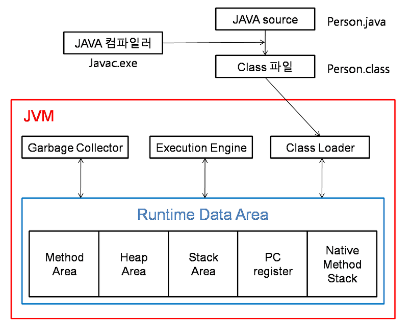

# 인터프리터 언어와 컴파일 언어

## 인터프리터 언어

소스코드의 번역과 실행이 동시에 이루어진다.

코드를 한줄씩 바로바로~ 실행하는 언어한줄한줄 읽어서 실행하므로 컴파일 언어에 비해 속도가 느리다

빌드 과정이 없어 빠른 수정이 가능하다

`예) 자바스크립트, 파이썬, sql, java, ...`

## 컴파일 언어

소스코드를 한꺼번에 컴파일 한 후 실행한다.

코드를 다 작성하고 -> 빌드(컴파일) -> 실행파일 생성(.exe 등)

고급언어를 저급언어로 바꿔주는 거임 기계가 이해하기 쉽도록

규모가 클 경우 실행이 빠르다. 비록 컴파일은 오래 걸릴지라도..

`예) C, C++, C#, Go, java...`

### Java

는 두가지 방식에 다 해당되는데...

컴파일 언어는 실행 환경이 달라지면 실행되지 않는다는 문제가 있다.

이를 보완하기 위함.

.java -> .class `컴파일`

이후 런타임 환경에서 `인터프리터` 방식으로 실행

---

### 컴파일과 빌드의 차이가 뭘까?

### 컴파일

개발자가 작성한 코드(고급언어)를 바이너리 코드(=기계어=저급언어)로 변환하는 과정

(목적파일=바이너리파일=실행파일이 생성됨)

### 빌드

소스코드 파일을 실행 가능한 산출물로 만드는 일련의 과정

컴파일은 빌드의 부분집합이다