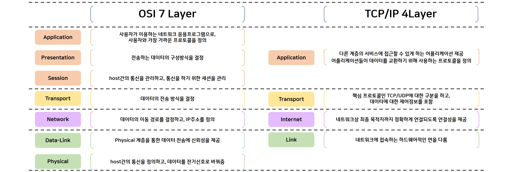

# CS study : 03 TCP & UDP

> [Interview_Question_for_Beginner](https://github.com/JaeYeopHan/Interview_Question_for_Beginner)/**DataStructure**/
>
> [개념 정리 - (8) 컴퓨터 네트워크 편 by 정주홍](https://brunch.co.kr/@toughrogrammer/16)

- 위 repository 를 읽고 정리한 글입니다.

## OSI 7 layers

- 인터넷 프로토콜 스위트(internet protocol suite) 는 인터넷에서 컴퓨터들이 서로 정보를 주고 받는 데 쓰이는 프로토콜의 집합이다.
- 프토로콜의 네트워킹 범위에 따라 다음과 같이 추상화 계층으로 나눈다. 이 계층들은 특정 계층이 변경되었을 때 다른 계층이 영향을 받지 않도록 유연하게 설계되어 있다.

 

1. 물리 계층 (Physical Layer)

   - 실제 장치를 연결하기 위한 전기적 / 물리적 세부 사항을 정의한 계층
   - 다만, 데이터가 무엇인지, 에러가 있는 지 등에는 전혀 신경쓰지 않고, 데이터를 전기적인 신호로 변환해서 주고 받는 기능만 한다.
   - 인터넷 케이블, 라우터 스위치 등

2. 데이터 링크 계층 (Data Link Layer)

   - 장치 간 신호를 전달하는 물리 계층을 이용하여 네트워크 상의 주변 장치들 간의 데이터를 전송하는 역할을 한다.
   - 물리 계층을 통해 송수신되는 정보의 오류와 흐름을 관리하여 안전한 정보의 전달을 수행할 수 있도록 돕는다.

3. 네트워크 계층 (Network Layer)

   - 전송 계층에서 보내려는 패킷을 목적지 노드까지 도착시키는 것
   - 현재 라우터에서 연결된 라우터 중 어떤 라우터로 보내는 것이 목적지까지의 최적 경로인지 결정하는 `라우팅` 을 수행한다.
   - 라우팅을 수행하면 어떤 헤더를 가진 패킷을 어떤 링크로 전송하라는 정보가 정리된 `포워딩 테이블` 이 생성된다.

4. 전송 계층 (Transport Layer)

   - 통신을 활성화하기 위해 포트를 열어 응용 프로그램들이 전송을 할 수 있도록 한다.

5. 세션 계층 (Session Layer)

   - 응용 프로세스가 통신을 관리하는 방법을 제공한다.
   - 이 계층의 프로토콜을 통해, 통신 연결이 손실되는 경우 연결 복구 시도가 가능하다.

6. 표현 계층 (Presentation Layer)

   - 코드 간 번역을 담당하는 계층으로, 인코딩이나 암호화 등의 동작이 이루어진다.
   - 응용 계층(사용자 시스템)에서 데이터 형식 상 차이를 다루는 부담을 덜어준다.

7. 응용 프로그램 계층 (Application Layer)

   - 응용 프로세스와 직접 관계하여 일반적인 응용 서비스를 수행하는 계층
   - 사용자에게 직접적으로 보이는 부분이며 상호작용 한다.
   - ex) 웹 브라우저, 응용 프로그램 (Outlook, Email, Skype ...)

A-P-S-T-N-D-P
아페서 터(지)니 뒤(에서) 피(가 나더라)
 

### 계층 간 데이터 송수신 과정

데이터 단위

- 애플리케이션 계층: Message
- 전송 계층: Segment(TCP), Datagram(UDP)
- 네트워크 계층: Packet
- 데이터링크 계층: Frame
- 물리 계층: Bit

---

## 전송 계층 (Transport Layer)

전송 계층은 송신자와 수신자를 연결하는 통신 서비스를 제공하며, 애플리케이션과 인터넷 계층 사이의 데이터가 전달될 때의 중계 역할을 한다.

연결 지향 데이터 스트림, 신뢰성, 흐름 제어, 다중화와 같은 편리한 서비스를 제공한다.

1. `UDP(User Datagram Protocol, 사용자 데이터그램 프로토콜)`

- 비연결형 프로토콜:
- 순서를 보장하지 않고, 수신 여부를 확인하지 않으며 단순히 데이터만 주는 `데이터그램 패킷 교환 방식` 을 사용한다.
  - 데이터그램 패킷 교환 방식은, 패킷이 독립적으로 이동하며 최적의 경로를 선택하여, 하나의 메시지에서 분할된 여러 패킷은 서로 다른 경로로 전송될 수 있으며 도착한 **순서 또한 다를 수** 있는 방식을 뜻한다.

 

2. `TCP(Transmission Control Protocol, 전송제어 프로토콜)`

- 대부분의 인터넷 응용 분야들은 신뢰성과 순차적인 전달 을 필요로 한다. UDP 로는 이를 만족시킬 수 없으므로 다른 프로토콜이 필요하여 탄생한 것이 TCP이다.

- 패킷 사이의 순서를 보장하고 연결지향 프로토콜을 사용해 연결하여, 신뢰성을 구축하고 수신 여부를 확인하며 `가상회신 패킷 교환 방식` 을 사용한다.
  - 가상 회신 패킷 교환 방식은 각 패킷에는 가상회선 식별자가 포함되며, 모든 패킷을 전송하면 가상회선이 해제되고 패킷들은 전송된 **순서대로** 도착하는 방식을 말한다. (송신 호스트에서 수신 호스트까지 하나의 회선을 선택하여 전송된다.)

UDP 프로토콜은 TCP 가 제공하는 여러 서비스를 제공하지 않기 때문에, 부하가 매우 적다. 따라서 많은 요청을 처리하고 신뢰성이 떨어져도 괜찮은 서비스들에서 유용하게 쓰인다.

DNS, VoIP(음성 인터넷 프로토콜), 온라인 게임 서버 등에서 쓰인다.

---

### TCP 제공 서비스

#### 연결 제어

TCP 프로토콜에서 통신이 이루어지기 위해서는 먼저 서로 연결되어야 하고, 서로 임의의 시작 순서 번호를 알려줘야 한다. 이 과정을, `TCP 3-way-handshaking` 라고 하며, 연결 종료 시엔 4-way-handshaking 을 통해 가능하다.

#### 흐름 제어

송신량과 수신 처리량을 일치시키는 것을 `흐름 제어` 라고 한다.

수신 측이 수신 가능한 양보다더 많은 데이터를 전송하려 해봤자, 수신 측의 버퍼에 남은 공간이 없다면 힘들게 전송한 데이터를 버리게 되므로, 수신 측이 처리할 수 있는 양만큼만 전송하도록 제어하는 서비스가 필요하다.

이를 위해 크게 Stop and Wait 방식과, Sliding Window 방식이 사용된다.

#### 혼잡 제어

네트워크가 혼잡하다고 판단되어 데이터 송신량을 떨어뜨리는 것을 `혼잡 제어`라고 한다.

신뢰성 있는 데이터 전송 알고리즘에 의하면, 네트워크 망이 처리 가능한 데이터량을 넘어서는 데이터량이 전송되는 경우, 전송 실패한 데이터를 다시 전송 시도하여 악순환이 반복되므로 혼잡 제어가 필요하다.

#### 다중화

응용 프로그램이 소켓을 통해 데이터를 전송하는 것부터 TCP 프로토콜이 시작된다. 그러나 한 컴퓨터에 여러 소켓과 프로세스가 존재할 수 있기 때문에, OS 에서는 소켓과 프로세스를 식별하기 위해 포트(port) 번호를 따로 둔다.

보통 컴퓨터에 연결된 통신 링크는 하나이기 때문에, 하나의 링크를 통해 여러 소켓의 데이터를 주고 받아야 한다. 이를 위해 OS 에서는 전송하려는 데이터를 TCP/UDP 세그먼트로 만들 때 헤더를 추가하여 공통적으로 출발지 포트 번호와 목적지 포트 번호를 둔다.

이러한 작업을 `다중화(Multiplexing)` 이라고 하며, 목적지에 도착한 세그먼트의 헤더를 확인하여 `Demultiplexing` 을 통해 대상 소켓에게 데이터를 전달한다.
