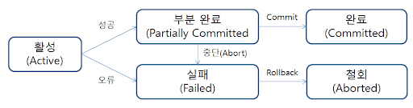

# 트랜잭션 Transaction

- 데이터베이스 상태를 일관적으로 유지하기 위한 병행 수행 제어 및 회복의 기본 단위
- 한꺼번에 모두 수행되어야 할 일련의 데이터베이스의 논리적 집합

- 작업의 단위는 사람이 정한다.

예) 게시판에 글을 등록하려고 한다. 글을 작성하고, 게시하고, 다시 게시판으로 돌아온다고 한다.

작성한 글을 데이터에 올릴때 Insert, 게시판 목록으로 나가서 게시판의 글들을 가져올 때 select 작업이 이루어진다. 이 때 insert + select 가 하나의 트랜잭션 단위.

## 특성 (ACID)

### 1. 원자성 Atomicity

- 분해가 불가능한 작업의 최소 단위
- 연산 전체가 성공 또는 실패 (**All or Nothing**)
  
    → 하나의 트랜잭션은 Commit 되거나 Rollback 된다.
    
- 하나라도 실패할 경우 전체가 취소되어야 함
- 주요기법
    - Commit: 하나의 트랜잭션이 성공적으로 끝나고, 데이터베이스가 일관성 있는 상태에 있거나 하나의 트랜잭션이 끝났을 때 사용하는 연산.
    - Rollback: 하나의 트랜잭션이 비정상적으로 종료되어 트랜잭션 원자성이 깨질 경우 처음부터 다시 시작하거나, 부분적으로 연산을 취소하는 연산.

### 2. 일관성 Consistency

- 트랜잭션 실행 성공 후 항상 **일관된 데이터베이스 상태**를 보존해야 함
- 주요기법
    - 무결성 제약조건
        - 무결성이란: 데이터의 정확성, 일관성. 즉, 데이터에 결함이 없는 상태.
        - 무결성을 보장하기 위해 저장, 삭제, 수정 등을 제약하기 위한 조건
    - 병행제어: 다수 사용자 환경에서 여러 트랜잭션을 수행할 때, 데이터베이스 일관성 유지를 위해 상호작용을 제어하는 기법

### 3. 독립성 Isolation

- 트랜잭션 실행 중 생성하는 연산의 중간 결과를 다른 트랜잭션이 접근 불가
- 주요기법
    - Read Uncommitted: commit이나 rollback 여부에 상관없이 다른 트랜잭션에서 보여짐
    - Read Committed: commit이 완료된 데이터만 다른 트랜잭션에서 보여짐
    - Repeatable Read: 하나의 트랜잭션 내에서 동일 select 쿼리를 실행했을 때는 항상 같은 결과를 가져와야 한다는 정합성 정의
    - Serializable: 선행 트랜잭션이 특정 데이터 영역을 순차적으로 읽을 때, 해당 데이터 영역 전체에 대한 접근을 제한하는 수준
    - 더 자세히 알고싶다면,,,, [[MySQL\] isolation level 종류 및 특징 :: Louis.Kim 의 제 3막 (tistory.com)](https://hyunki1019.tistory.com/111)

### 4. 지속성 Durability

- 성공이 완료된 트랜잭션의 결과는 영구적으로 데이터베이스에 저장

- 주요기법
    - 회복기법: 트랜잭션을 수행하는 도중 장애로 인해 손상된 데이터베이스를 손상되기 이전의 정상적인 상태로 복구시키는 작업
    
      

## 상태변화

- 활성 (Active)
    - 초기상태, 트랜잭션이 실행중일 때 가지는 상태
- 부분 완료 (Partially Committed)
    - 마지막 명령문이 실행된 후에 가지는 상태 (commit 직전)
- 완료 (Commited)
    - 트랜잭션이 성공적으로 완료된 후 가지는 상태
- 실패 (Failed)
    - 정상적인 실행이 더 이상 진행될 수 없을 때 가지는 상태
- 철회 (Aborted)
    - 트랜잭션이 취소되고 데이터베이스가 트랜잭션 시작 전 상태로 환원된 상태