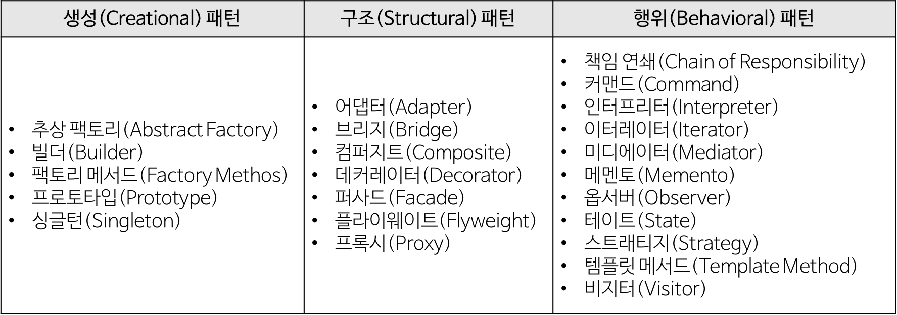

# 디자인 패턴

디자인 패턴이란 소프트웨어를 설계할 때 특정 맥락에서 자주 발생하는 고질적인 문제들을 해결하기 위한 방법 중 하나. 재이용하기 좋은 형태로 특정의 규약을 묶어서 정리한 것. 특정한 상황에서 구조적인 문제를 해결하는 방식을 설명해준다.

# 디자인 패턴 구조

- 콘텍스트 (Context)
    - 문제가 발생하는 여러 상황을 기술한다. 즉, 패턴이 적용될 수 있는 상황을 나타낸다.
    - 경우에 따라서는 패턴이 유용하지 못한 상황을 나타내기도 한다.
    
- 문제 (Problem)
    - 패턴이 적용되어 해결될 필요가 있는 여러 디자인 이슈들을 기술한다.
    - 이때, 여러 제약 사항과 영향력도 문제 해결을 위해 고려해야 한다.
    
- 해결 (Solution)
    - 문제를 해결하도록 설계를 구성하는 요소들과 그 요소들 사이의 관계, 책임, 협력 관계를 기술한다.
    
    - 해결은 반드시 구체적인 구현 방법이나 언어에 의존적이지 않으며 다양한 상황에 적용할 수 있는 일종의 템플릿이다.
    
      

# 디자인 패턴의 종류

### GoF (Gang of Fours)

- Erih Gamma, Richard Helm, Ralph Johnson, John Vissides
- 23가지의 디자인 패턴을 정리하고 각각의 디자인 패턴을 생성, 구조, 행위 3가지로 분류했다.

### 생성 패턴

- 객체 생성에 관련된 패턴
- 객체의 생성과 조합을 캡슐화해 특정 객체가 생성되거나 변경되어도 프로그램 구조에 영향을 크게 받지 않도록 유연성을 제공한다.

### 구조 패턴

- 클래스나 객체를 조합해 더 큰 구조를 만드는 패턴
- 예를 들어 서로 다른 인터페이스를 지닌 2개의 객체를 묶어 단일 인터페이스를 제공하거나 객체들을 묶어 새로운 기능을 제공하는 패턴이다.

### 행위 패턴

- 객체나 클래스 사이의 알고리즘이나 책임 분배에 관련된 패턴
- 한 객체가 혼자 수행할 수 없는 작업을 여러 개의 객체로 어떻게 분배하는지, 또 그렇게 하면서도 객체 사이의 결합도를 최소화하는 것에 중점을 둔다.

---

# 싱글턴 패턴 Singleton

전역 변수를 사용하지 않고 **객체를 하나만 생성**하도록 하며, 생성된 객체를 **어디서든지 참조**할 수 있는 패턴.

왜 하나만? → 커넥션 풀, 스레드 풀, 디바이스 설정 객체 등의 경우 여러개의 인스턴스를 만들면 자원을 낭비하거나 버그를 발생시킬 수 있으므로

즉, 메모리 측면에서 효율적이며, 이미 생성된 인스턴스를 활용한다는 점에서 속도 측면으로도 이점이 있다고 볼 수 있다.

데이터 공유가 쉽다. 하지만 여러 클래스의 인스턴스에서 싱글톤 인스턴스의 데이터에 동시에 접근하게 되면 동시성 문제가 발생할 수 있다.

## 문제점

싱글톤 객체를 활용하는 객체간의 결합도가 높아짐.

사이드 이펙트 발생 확률이 생기며, 멀티 쓰레드 환경에서 동기화 처리 문제가 있을 수 있다.

참고: [싱글톤(Singleton) 패턴이란? (techcourse.co.kr)](https://tecoble.techcourse.co.kr/post/2020-11-07-singleton/)

# 옵저버 패턴 Observer

이벤트를 감시하면서 이벤트 발생 시, 미리 정의해 둔 어떤 동작을 즉각적으로 수행하게 해주는 패턴.

다른 객체의 상태 변화를 별도의 함수 호출 없이 즉각적으로 알 수 있다

→ 이벤트에 대한 처리를 자주 해야할 때 효율적.