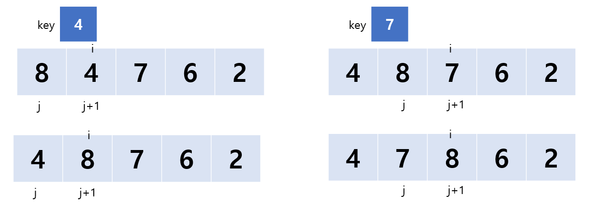
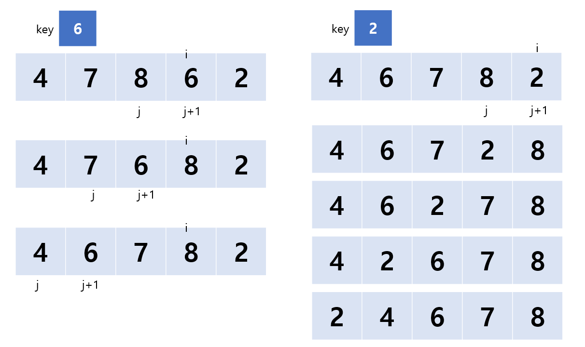
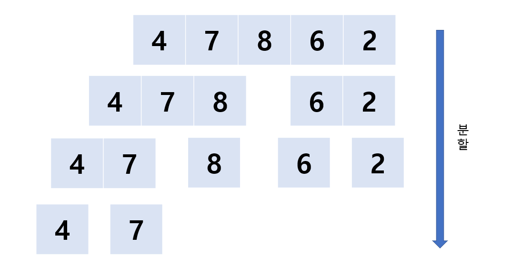
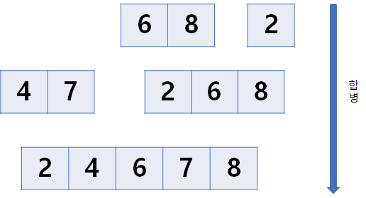

# 삽입 정렬 (Insertion Sort)

이미 정렬되어 있는 수열 중 자신이 들어가야 할 위치를 찾아 삽입한다.

### 과정

1. 배열의 한 원소인 key라는 값을 가지고 있고, 이 key를 알맞은 자리에 삽입한다.
2. key보다 큰 값은 하나씩 밀고, key보다 작은 값을 만났을 때 뒤에 삽입한다.





### 구현

```c
void insertSort(int arr[], int size)
{
	int key;
	for(int i=1; i<size; i++) //이전 값과 비교해야하므로 1부터 시작
	{
		key = arr[i];
		int j=j-1;
		while(j>=0 && arr[j]>key)
		{
			swap(arr[j], arr[j+1]);
			j--;
		}
		arr[j+1] = key;
	}
}
```

## 시간복잡도

- 최적의 경우: n
- 평균: n^2
- 최악의 경우: n^2

# 합병 정렬 (Merge Sort)

- **분할 정복** 알고리즘 중 하나
- 레코드의 크기가 큰 경우 이동횟수가 크므로 시간낭비 초래
  
    → 연결리스트로 구성된 경우 이동 횟수 작아짐
    
- 데이터 분포의 영향을 덜 받는다. 입력되는 데이터가 무엇이든 간에 정렬되는 시간은 동일하다.
- 크기가 큰 레코드를 정렬할 경우 연결리스트를 사용하면 다른 어떤 정렬보다 효율적이다.

### 과정

1. 배열을 같은 크기 2개로 분할한다
2. 리스트의 길이가 0또는 1이면 정렬된 것으로 본다
3. 그렇지 않을 경우 또 분할한다
4. 분할이 끝나면 순차적으로 결합한다






## 시간복잡도

- 최적의 경우: nlogn
- 평균: nlogn
- 최악의 경우: nlohn

참고자료: [합병 정렬(=병합 정렬) 이란? (tistory.com)](https://todaycode.tistory.com/54)