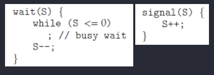
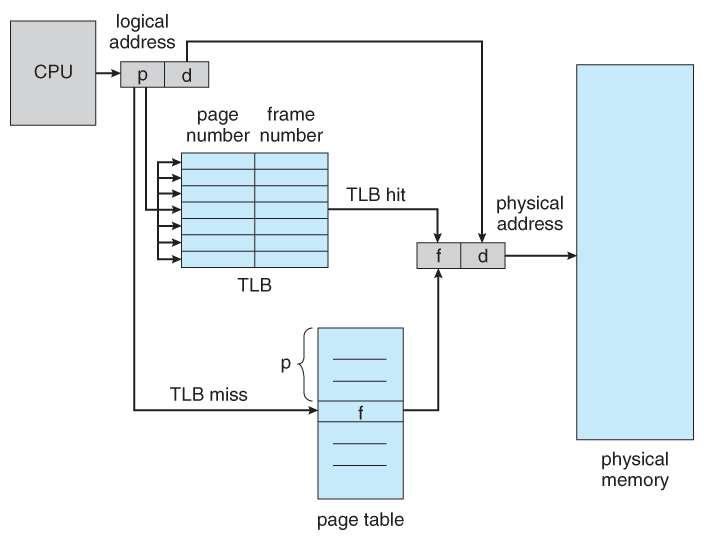

# Process & Thread


## 용어 정리


### 프로그램(Program)

- 어떤 작업을 위해 운영체제 위에서 **실행할 수 있는** 파일

- 명령어, 코드 및 정적인 데이터의 묶음

  ​

### 프로세스(Process)

- 운영체제 위에서 **실행중인** 프로그램

- 프로그램 명령어와 데이터들이 메모리에 올라오고 실행 중 또는 실행 대기중인 상태

  ​

### 프로세서(Processor)

- 프로세스가 **동작**될 수 있도록 하는 **하드웨어**(=cpu)

- 동작 : 프로그램의 자원들이 메모리에 올라오고, 실행 되어야 할 코드의 메모리 주소를 CPU의 레지스터로 올리는 것.

  ​

### 쓰레드(Thread)

- 프로세스 내에서 실행되는 흐름의 단위
- 프로세스의 특정한 수행 경로
- 프로세스가 할당받은 자원을 이용하는 실행의 단위
- 프로세스의 Text, data, heap 영역을 공유한다.

##### 따라서, **프로세스**는 메모리에 적제되어 **프로세서**에 의해 실행중인 **프로그램**이고

**쓰레드는 프로세스 내에서 자원을 공유하며 실행되는 흐름의 단위이다.**


------


## 프로세스의 구성


- Code 영역: Program의 코드, Binary Code 상태로 올라가게 되는데 이 영역을 뜻한다.

- Data 영역 : 전역변수, 정적변수의 할당

- Stack 영역 : 매개변수, 지역변수, 함수 호출시 전달되는 인수 값 등 임시적인 자료

- Heap 영역 : 동적으로 할당되는 메모리

  ​

## 프로세스의 상태 (Life Cycle)


1. 생성 (new)
   - 프로세스가 생성되었지만 아직 승인 받지 못한 상태 (생성 중)
2. 준비완료 (Ready)
   - 중앙처리장치가 사용 가능하게 될 때 그것을 할당받을 수 있는 상태
3. 실행 (Running)
   - 프로세스가 중앙처리장치(CPU)를 차지하고 있는 상태
4. 대기 (Waiting)
   - Running 상태 였다가 입출력 처리 등을 하게 되면, 중앙처리장치를 양도하고 입출력 처리가 완료될 때까지 대기하고 있는 상태 (특별한 사건을 기다림)
5. 종료 ( terminated)
   - 프로세스 실행이 완료되고 할당된 CPU를 반납

------


## PCB (Process Control Block)


- 운영체제가 프로세스를 제어하기 위해 정보를 저장해 놓는 곳으로, 프로세스의 상태 정보를 저장하는 구조체이다.
- 프로세스 상태 관리와 문맥교환(Context Switching)을 위해 필요하다.
- PCB는 프로세스 생성 시 만들어지며 주기억장치에 유지된다.

PCB 는 특정 **프로세스에 대한 중요한 정보를 저장** 하고 있는 운영체제의 자료구조이다. 운영체제는 프로세스를 관리하기 위해 **프로세스의 생성과 동시에 고유한 PCB 를 생성** 한다. 프로세스는 CPU 를 할당받아 작업을 처리하다가도 프로세스 전환이 발생하면 진행하던 작업을 저장하고 CPU 를 반환해야 하는데, 이때 작업의 진행 상황을 모두 PCB 에 저장하게 된다. 그리고 다시 CPU 를 할당받게 되면 PCB 에 저장되어있던 내용을 불러와 이전에 종료됐던 시점부터 다시 작업을 수행한다.


##### *PCB 에 저장되는 정보*

- 프로세스 식별자(Process ID, PID) : 프로세스 식별번호
- 프로세스 상태 : new, ready, running, waiting, terminated 등의 상태를 저장
- 프로그램 카운터 : 프로세스가 다음에 실행할 명령어의 주소
- CPU 레지스터
- CPU 스케쥴링 정보 : 프로세스의 우선순위, 스케줄 큐에 대한 포인터 등
- 메모리 관리 정보 : 페이지 테이블 또는 세그먼트 테이블 등과 같은 정보를 포함
- 입출력 상태 정보 : 프로세스에 할당된 입출력 장치들과 열린 파일 목록
- 어카운팅 정보 : 사용된 CPU 시간, 시간제한, 계정번호 등

#### Context Switching???

CPU가 이전의 프로세스 상태를 PCB에 보관하고, 또 다른 프로세스의 정보를 PCB에서 읽어 레지스터에 적제하는 과정을 의미한다. Context Switching 과정에서 Overhead가 발생하지만 그럼에도 전체적인 흐름에 도움이 되기 떄문에 꼭 필요한 작업이다.

즉, 실행중인 프로세스가 대기상태로 돌아가고 대기 중이던 프로세스가 실행되는 과정


##### 언제 발생할까?

- 우선순위가 높은, 급한 프로세스를 먼저 처리해야 할때
- 실행중인 프로세스가 CPU사용을 허가받은 시간을 모두 소모할때
- I/O 입출력을 위해 대기해야 할때

##### Overhead??

Context Switching을 할때 발생하는 간접적인 처리시간, 메모리 등을 의미한다.


------


## 쓰레드의 특징


- 스레드는 프로세스 내에서 각각 Stack만 따로 할당받고 Code, Data, Heap 영역은 공유한다.
- 스레드는 한 프로세스 내에서 동작되는 여러 실행의 흐름으로, 프로세스 내의 주소 공간이나 자원들(힙 공간 등)을 같은 프로세스 내에 스레드끼리 공유하면서 실행된다.
- 같은 프로세스 안에 있는 여러 스레드들은 같은 힙 공간을 공유한다. 반면에 프로세스는 다른 프로세스의 메모리에 직접 접근할 수 없다.
- 각각의 스레드는 별도의 **레지스터와 스택**을 갖고 있지만, 힙 메모리는 서로 읽고 쓸 수 있다.
- 한 스레드가 프로세스 자원을 변경하면, 다른 이웃 스레드(sibling thread)도 그 변경 결과를 즉시 볼 수 있다.

##### 레지스터와 스택

- stack은 프로시저의 복귀 주소나, 지역 변수같이 일시적이고 독립적인 실행환경을 제공한다. **스레드는 하나의 독립적인 실행 단위이기 때문에 각각 해당 실행에 대한 독립적 stack을 가진다.**
- 스레드는 프로세스와 같이 CPU를 할당받고, 선점당할 수 있다. 따라서 문맥교환(Context Switching)이 발생하게 되므로 **실행하고 있는 코드의 지점을 저장하는 PC Register는 스레드마다 독립적으로 할당**되어야 한다.

------


## 멀티 스레드

- 같은 프로세스 내에서 두개 이상의 쓰레드가 동작
- 프로세스의 자원을 공유
- 향상된 응답성
- Context switching 비용이 적다. (**Context Switching :** 현재 진행하고 있는 Task(Process, Thread)의 상태를 저장하고 다음 진행할 Task의 상태 값을 읽어 적용하는 과정을 말합니다.)
- 자원을 공유하기 때문에 **충돌**을 주의해야한다. (데드락이 발생할 수 있다)

### 멀티 스레딩의 장점

프로세스를 이용하여 동시에 처리하던 일을 스레드로 구현할 경우 메모리 공간과 시스템 자원 소모가 줄어들게 된다. **스레드 간의 통신**이 필요한 경우에도 별도의 자원을 이용하는 것이 아니라 전역 변수의 공간 또는 동적으로 할당된 공간인 **Heap 영역**을 이용하여 데이터를 주고받을 수 있다. 그렇기 때문에 프로세스 간 통신 방법에 비해 스레드 간의 통신 방법이 훨씬 간단하다. 심지어 스레드의 context switch 는 프로세스 context switch 와는 달리 캐시 메모리를 비울 필요가 없기 때문에 더 빠르다. 따라서 시스템의 throughput 이 향상되고 자원 소모가 줄어들며 자연스럽게 프로그램의 응답 시간이 단축된다. 이러한 장점 때문에 여러 프로세스로 할 수 있는 작업들을 하나의 프로세스에서 스레드로 나눠 수행하는 것이다.

### 멀티 스레딩의 문제점


멀티 프로세스 기반으로 프로그래밍할 때는 프로세스 간 공유하는 자원이 없기 때문에 동일한 자원에 동시에 접근하는 일이 없었지만 멀티 스레딩을 기반으로 프로그래밍할 때는 이 부분을 신경써줘야 한다. 서로 다른 스레드가 데이터와 힙 영역을 공유하기 때문에 **어떤 스레드가 다른 스레드에서 사용중인 변수나 자료구조에 접근하여** 엉뚱한 값을 읽어오거나 수정할 수 있다.

그렇기 때문에 멀티스레딩 환경에서는 **동기화** 작업이 필요하다. 동기화를 통해 작업 처리 순서를 컨트롤 하고 공유 자원에 대한 접근을 컨트롤 하는 것이다. 하지만 이로 인해 병목현상이 발생하여 성능이 저하될 가능성이 높다. 그러므로 과도한 락으로 인한 병목현상을 줄여야 한다.


### 멀티 스레드 vs 멀티 프로세스

멀티 스레드는 멀티 프로세스보다 적은 메모리 공간을 차지하고 문맥 전환이 빠르다는 장점이 있지만, 오류로 인해 하나의 스레드가 종료되면 전체 스레드가 종료될 수 있다는 점과 동기화 문제를 안고 있다. 반면 멀티 프로세스 방식은 하나의 프로세스가 죽더라도 다른 프로세스에는 영향을 끼치지 않고 정상적으로 수행된다는 장점이 있지만, 멀티 스레드보다 많은 메모리 공간과 CPU 시간을 차지한다는 단점이 존재한다. 이 두 가지는 동시에 여러 작업을 수행한다는 점에서 같지만 적용해야 하는 시스템에 따라 적합/부적합이 구분된다. 따라서 대상 시스템의 특징에 따라 적합한 동작 방식을 선택하고 적용해야 한다.


**EX)** **인터넷익스플로어 (Internet Explorer)** **VS** **크롬 (Chrome)**


------


# CS study : 04 OS scheduling

> [Interview_Question_for_Beginner](https://github.com/JaeYeopHan/Interview_Question_for_Beginner)/**OS**/
>
> [[운영체제] 스케줄러(scheduler)](https://dheldh77.tistory.com/entry/%EC%9A%B4%EC%98%81%EC%B2%B4%EC%A0%9C-%EC%8A%A4%EC%BC%80%EC%A4%84%EB%9F%ACScheduler)

- 위 repository 를 읽고 정리한 글입니다.

## Scheduler

> 한정적인 메모리를 여러 프로세스가 효율적으로 사용할 수 있도록 다음 실행 시간에 실행할 수 있는 프로세스 중에 하나를 선택하는 역할

*프로세스를 스케줄링하기 위한 Queue 에는 세 가지 종류가 존재한다.*

- Job Queue(Batch Queue) : 현재 시스템 내에 있는 모든 프로세스의 집합
- Ready Queue : 현재 메모리 내에 있으면서 CPU 를 잡아서 실행되기를 기다리는, ready 상태의 프로세스의 집합
- Device Queue : Device I/O 작업을 대기하고 있는 프로세스의 집합

스케줄러의 종류는 3가지로 나눌 수 있다. 

1. **장기 스케줄러(Long-term scheduler)** / 잡 스케줄러(Job scheduler)
   - 프로세스의 상태
     new -> ready(in memory)
   - 메모리는 한정되어 있는데 많은 프로세스들이 한꺼번에 메모리에 올라올 경우, 대용량 메모리(일반적으로 디스크)에 임시로 저장된다. 
     - 이 pool 에 저장되어 있는 프로세스 중 어떤 프로세스에 메모리를 할당하여 ready queue 로 보낼지 결정하는 역할을 한다.
   - 디스크와 메모리 사이의 스케줄링 담당
   - degree of multiprogramming (실행 중인 프로세스의 수) 제어
2. 단기 스케줄러(Short-term scheduler) / CPU 스케줄러(CPU scheduler)
   - 프로세스의 상태
     ready -> running -> waiting -> ready
   - Ready Queue 에 존재하는 프로세스 중 어떤 프로세스를 running 시킬지 결정.
   - 메모리와 CPU 사이의 스케줄링 담당
3. **중기 스케줄러(Mid-term scheduler)** / 스와퍼(Swapper)
   - 프로세스의 상태
     ready -> suspended (외부적인 이유로 프로세스의 수행이 정지된 상태로 메모리에서 내려간 상태, 스스로 돌아갈 수 없다.)
   - 여유 공간을 마련하기 위해 프로세스를 통째로 메모리에서 디스크로 쫓아내는 역할(swap out)
   - 프로세스에게서 memory 를 deallocate
   - degree of multiprogramming 제어

## CPU scheduler

**Preemptive** vs **Non**-**preemptive**

- 선점형 vs 비선점형 
- 비선점형 스케쥴링 
  - 프로세스가 자발적으로 CPU 점유를 멈출 때 까지, 기다려야 한다. (프로세스가 스스로 종료되거나, waiting 상태로 진입할 때까지 )
- 선점형 스케쥴링
  - a process can be preempted by the scheduler
  - 프로세스를 쫓아낼 수 있다. 

------

#### FCFS(First Come First Served)


특징

- 가장 간단한 방법, FIFO Queue 로 쉽게 구현 가능.
- 비선점형(Non-Preemptive) 스케줄링
  일단 CPU 를 잡으면 CPU burst 가 완료될 때까지 CPU 를 반환하지 않는다. 할당되었던 CPU 가 반환될 때만 스케줄링이 이루어진다.

단점

- convoy effect: 소요시간이 긴 프로세스가 먼저 도달하여 효율성을 낮추는 현상이 발생한다.
- 하나의 거대한 CPU-bound process 때문에, 작은 CPU 작업만을 요하는  I/O-bound process 까지 오랜 시간 기다려야 하는 비효율성 발생 

------

#### SJF(Shortest - Job - First)


특징 

- 다른 프로세스가 먼저 도착했어도 CPU burst time 이 짧은 프로세스에게 선 할당
- 비선점형(Non-Preemptive) 스케줄링

문제점

- starvation: 효율성을 추구하는게 가장 중요하지만 특정 프로세스가 지나치게 차별받으면 안된다. 이 스케줄링은 극단적으로 CPU 사용이 짧은 job 을 선호하므로, 사용 시간이 긴 프로세스는 거의 영원히 CPU 를 할당받을 수 없다.

------

#### SRTF(Shortest Remaining Time First)


특징

- Preemptive SJF scheduling (선점형 SJF 스케줄링)
- 새로운 프로세스가 도착할 때마다 새로운 스케줄링이 이루어진다.
- 선점형 (Preemptive) 스케줄링
  현재 수행중인 프로세스의 남은 burst time 보다 더 짧은 CPU burst time 을 가지는 새로운 프로세스가 도착하면 CPU 를 뺏긴다.
- average waiting time 이 가장 적다. 

문제점

- starvation
- 새로운 프로세스가 도달할 때마다 스케줄링을 다시하기 때문에 CPU burst time(CPU 사용시간)을 측정할 수가 없다.

------

#### Priority Scheduling


특징

- 우선순위가 가장 높은 프로세스에게 CPU 를 할당하는 스케줄링이다. 우선순위란 정수로 표현하게 되고 작은 숫자가 우선순위가 높다.
- 선점형 스케줄링(Preemptive) 방식
  더 높은 우선순위의 프로세스가 도착하면 실행중인 프로세스를 멈추고 CPU 를 선점한다.
- 비선점형 스케줄링(Non-Preemptive) 방식
  더 높은 우선순위의 프로세스가 도착하면 Ready Queue 의 Head 에 넣는다.

문제점

- starvation: 무기한 봉쇄(Indefinite blocking), 실행 준비는 되어있으나 CPU 를 사용못하는 프로세스를 CPU 가 무기한 대기하는 상태

해결책

- aging: 아무리 우선순위가 낮은 프로세스라도 오래 기다리면 우선순위를 높여주자.

------

#### Round Robin


특징

- 현대적인 CPU 스케줄링
- 각 프로세스는 동일한 크기의 할당 시간(time quantum)을 갖게 된다. (generally from 10 to 100 milliseconds)
- 할당 시간이 지나면 프로세스는 선점당하고 ready queue 의 제일 뒤에 가서 다시 줄을 선다.
- `RR`은 CPU 사용시간이 랜덤한 프로세스들이 섞여있을 경우에 효율적
- `RR`이 가능한 이유는 프로세스의 context 를 save 할 수 있기 때문이다.

장점

- `Response time`이 빨라진다.
  n 개의 프로세스가 ready queue 에 있고 할당시간이 q(time quantum)인 경우 각 프로세스는 q 단위로 CPU 시간의 1/n 을 얻는다. 즉, 어떤 프로세스도 (n-1)q time unit 이상 기다리지 않는다.
- 프로세스가 기다리는 시간이 CPU 를 사용할 만큼 증가한다.
  공정한 스케줄링이라고 할 수 있다.

------

#### Round Robin + Priority

우선 순위 기준으로 프로세스를 실행하고, 

프로세스 간의 우선 순위가 같은 경우엔  Round Robin 스케쥴링을 사용한다. 

#### Multi-Level Queue(MLQ) Scheduling

 

#### Multi-Level Feedback Queue(MLFQ) Scheduling

high priority 만 계속해서 실행하는 것을 막고자, 점점 더 많은 time quantum, CPU-burst time 을 할당한다.

 

### etc

CPU burst ?


# 동기와 비동기


## 동기

요청과 결과가 동시에 일어남

- 설계가 간단하고 직관적이다
- 요청 결과가 나올 때까지 다른 작업을 할 수 없음

## 비동기

요청한 자리에서 동시에 결과가 나오지 않음

- 동기보다 복잡
- 요청을 해두고 결과가 나올 때까지 다른 작업을 할 수 있다 → 자원의 효율적 사용


# CS study : 05 OS synchronization

> [Interview_Question_for_Beginner](https://github.com/JaeYeopHan/Interview_Question_for_Beginner)/**OS**/

- 위 repository 를 읽고 정리한 글입니다.

## 프로세스 동기화 Synchronization

### Critical Section(임계영역)

동일한 자원을 동시에 접근하는 작업(e.g. 공유하는 변수 사용, 동일 파일을 사용하는 등)을 실행하는 코드 영역을 Critical Section 이라 칭한다.

- share a **logical address space (thread)** or **data (shared memory, message passing)**

문제 

- **데이터 불일치(data inconsistency)** 를 불러올 수 있다.
  - => 데이터 각각 올바르게 동작하는 두 개의 프로세스라도, concurrently (동시에) 실행되는 경우 올바르지 않은 결과를 불러온다. 
- 특히 **Race Condition** 에서 문제가 발생한다.  
  - data 를 공유하는 상황에서, 실행 결과가 process 혹은 thread 의 순서에 의존하는 경우.
  - 이를 방지하기 위해 **동기화(Synchronization)**가 필요한데, 이는 
    - 프로세스 간 공유하는 데이터는,
    - 한 번에 오직 하나의 프로세스 만이 조작 가능해야 함을 말한다. (***only one process at a time*** can manipulate the shared data)

### The Critical Section Problem

임계 영역을 함께 사용할 수 있는 프로토콜 설계 방법 (동시에 두 프로세스가 임계 영역에서 실행되지 않도록 하는 방법을 고안)

Requirements(해결을 위한 기본조건)

- **Mutual Exclusion(상호 배제)**
  프로세스 P1 이 임계 영역에서 실행중이라면, 다른 프로세스들은 그들이 가진 임계 영역 에서 실행될 수 없다.

- **Progress(진행)**
  임계 영역에서 실행중인 프로세스가 없고, 임계 영역에 진입하고 싶은 프로세스가 있다면, 다음으로 임계 영역에 진입할 프로세스의 선택을 무한정으로 연기할 수 없다.  

  이는 **deadlock** (다음으로 critical section 에 진입하기 위해 대기 중인 process 중 아무도 진입하지 못하는 상황) 을 방지하기 위함이다. 

- **Bounded Waiting(한정된 대기)**
  P1 가 Critical Section 에 진입 신청 후 부터 받아들여질 때가지, 다른 프로세스들이 Critical Section 에 진입하는 횟수는 제한이 있어야 한다.

  이는 **starvation** 을 방지하기 위함이다. 

가장 단순한 해결책은, interrupt 를 막아 context switching 이 발생하지 않도록 한다. 이는 예측 불가능한 modification 은 없는 반면에, 시스템 성능이 매우 저하되므로 비현실적이다. 


### Synchronization Tools

**Higher-level software tools to solve the CSP : **

- ***Mutex Locks*** : the simplest tools for synchronization. => control 2
- ***Semaphore*** : more robust, convenient, and effective tool. => control N
- ***Monitor*** : mutex 와 semaphore 의 단점을 극복
- ***Liveness*** : Progress 조건을 만족하도록 보장하여 deadlock 해결 

#### Mutex Locks

mutex : 상호 배제 (***mut***ual ***ex***clusion) 기술, 임계 영역을 보호하고, race condition 을 방지한다. 

- 임계 영역에 진입하기 전에, 반드시 lock 을 획득해야 하고
- 임계 영역을 빠져나올 때 (exit), lock 을 방출해야 한다.

열쇠를 얻고 반납한다!!

이를 위해서 아래 세 가지 구현 사항이 필요하다. 

- `acquire()` and `release()`
- `available`

    

**한계**

- **Busy waiting** : `acquire()` 에서 while 문을 계속해서 돌기 때문에, CPU 를 잡아먹는다. (마치 공회전)
  - **Spinlock** : busy waiting 을 일으키는 mutext lock 
    - Spinlock 을 유용하게 쓰는 방법도 있다. 
      - 멀티코어 시스템인 경우, busy waiting 하던 thread 가 context switch 없이 바로 실행 가능 
      - 이는 wait queue, ready queue 를 거치는 시간이 없으므로 빠르다. 

#### Semaphores

semaphore : 신호장치, 신호기 

**정의**

semaphore `S` 는

- 정수 변수 (integer variable) 이며,
- 오직 `wait()` 과 `signal()` 이라는 두 개의 standard atomic operation 에 의해서만 접근 가능하다.   



- 현재 공유 데이터로 접근 가능한 출입문의 갯수라고 생각하면 쉽다.
  - 혹은 목욕탕 열쇠를 생각하면 쉽다..?

**종류**

- 이진 세마포 *Binary* Semaphore
  - range only between 0 and 1 => similar to *mutex lock*
  - S = 1 이면, 결국 mutex lock 과 동일하다. 
- 카운팅 세마포 *Counting* Semaphore
  - **가용한 개수를 가진 자원** (a finite number of instances) 에 대한 접근 제어용으로 사용되며, 세마포는 그 가용한 **자원의 개수** 로 초기화 된다. 자원을 사용하면 세마포가 감소, 방출하면 세마포가 증가 한다.
  - S = n (n > 1)

Counting Semaphore **순서** 

1. S를 사용 가능한 자원의 갯수로 초기화 시켜준다.
2. 프로세스가 자원을 사용할 경우
   - `wait()` 을 실행하여 현재 사용가능한 S의 갯수를 줄여준다.
3. 프로세스가 자원을 반납할 경우
   - `signal()`을 실행하여 현재 사용가능한 S의 갯수를 늘려준다.
4. S = 0 인 경우 (= 모든 리소스가 사용 중인 경우)
   - S가 0보다 커질 때 까지 `Busy wait`

**한계**

- Busy Waiting 
- Deadlock

#### Monitor

semaphore 이후의 고수준  이자, 고급 언어의 설계 구조물로서, 개발자의 코드를 상호배제 하게끔 만든 **추상화된 데이터 형태**이다.

- 자원에 직접 접근이 어렵고, monitors 를 통해서만 접근할 수 있다. 
  - 공유자원 + 공유자원 접근함수로 구성
  - 2개의 queues: 배타동기(`Mutual exclusion queue`) + 조건동기(`Conditional synchronization`)
  - ex) Java Monitor
- 공유자원에 접근하기 위한 키 획득과 자원 사용 후 해제를 모두 처리한다. (세마포어는 직접 키 해제와 공유자원 접근 처리가 필요하다. )

위 방법들은 모두 Progress(진행) 과 bounded-waiting(유한 대기) 문제를 해결하지 못한다. 

#### Liveness

Progress와 bounded-waitiing 이 모두 만족하는 상황

저해 효소 

1. Deadlock
2. Starvation
3. Priority Inversion 

### etc

#### Peterson's Solution


mutual exclusion 을 보장하고, deadlock, starvation 을 방지하지만, machine language 단계에서의 오류 혹은 entry section 에서의 context switch 발생으로 인해 소수의 동기화 실패가 발생한다.  


#### Hardware Support for Synchronization

instruction level 에서 원자성을 보존하기 어려우므로, Hardware 설계로 modify 또는 swap 동작을 하나의 회로로 one clock 에 해결할 수 있도록 하자.


# 메모리전략

### 메모리란?

> 기억장치. 각각의 주소를 가진 대용량의 바이트 배열.

CPU는 메모리에서 불러와서 연산 작업들을 하는데, 다음과 같다.

1. PC(다음 연산할 명령어의 주소를 가르키는 레지스터)가 가리키는 연산을 fecth
2. 그 연산을 decode(해석)하여 관련된 다른 피연산자를 메모리에서 fetch 할수도 있다.
3. 가져온 피연산자에 대한 연산이 실행되면, 결과는 다시 메모리에 저장(store)된다.

 <br>

## 프로세스의 메모리 접근

- 각 프로세스가 메모리의 주소 공간을 별도로 관리할 수 있는 게 멀티 프로그래밍
- 각 프로세스는 할당된 메모리 주소에 base resgister(시작) & limit register(끝)을 통해 접근할 수 있음

메모리 주소공간


- base register 보다 크거나 같고, base + limit register보다 작을 때 접근 권한을 가지고,
- 이 외의 주소 공간을 접근할려고 하면 segmentation fault에러(잘못된 주소에 접근하거나 read-only에 쓰려고할 경우 발생하는 에러)를 발생시킨다.


<br>

## 프로세스 주소 할당(Address Binding)

프로그램은 실행 가능한 binary 파일형태로 disk에 존재한다. 프로그램을 실행시키기위해 프로그램을 메모리로 옮겨진다. 이 때 실행을 위해 메모리로 옮겨지기 전 프로세스들은 **Input Queue**에서 대기한다.

- Input Queue에서 프로세스 하나 선택해서 메모리에 적재한다.
- 프로세스가 실행되면, 메모리의 연산과 데이터들을 접근한다.
- 프로세스가 종료되면, 프로세스가 사용하던 메모리 영역을 해제하고 다시 사용 가능해진다.

#### 주소 할당의 일련의 과정은 아래와 같이 이루어진다.

1. O/S커널이 실행된 프로그램의 주소의 할당
2. 프로세스 내 Symbolic address[3](https://cano721.tistory.com/15#footnote_15_3)를 컴파일러가 relocatable address[4](https://cano721.tistory.com/15#footnote_15_4)로 할당
3. 그 후 linker나 loader 이러한 relocatable address를 absolute address(절대 주소)로 할당한다. 

**주소할당순서 그림**

- 
  - source program 단계에선 symbolic address를 가짐
  - 컴파일 단계를 거치며, relocatable address로 할당
  - linker에 의해 logical address 할당
  - 실제로 메모리에 로드될때 physical address를 할당받음

 <br>


#### Logical(논리) vs Physical(물리) Address Space

- 논리 주소(logical address): CPU가 사용하고 있는 주소. 물리주소와는 상관 없음.
- 물리 주소(Pyhsical address): 실제로 메모리에 로드되어있는 주소.

#### MMU(Memory Management Unit)

: 논리 주소를 물리주소로 변경하여 연결시켜주는 하드웨어 디바이스.


#### 유동적인 로딩(Dynamic Loading)

- 메모리 주소공간을 효율적으로 사용하기 위해 파일 전체를 로드하는 것이 아닌 필요한 것만 그때 로드하는 것.
- relocatable linking loader가 필요할 때만 address table에 반영해준다.

#### Dynamic Linking and Shared Libraries

- static linking(정적 연결): 컴파일 시점에서 라이브러리 링커에 의해 연결되어 실행 파일의 일부분이 됨.
- dynamic linking(동적 연결): 해당 라이브러리를 사용할때 연결하여 사용. static linking과 다르게 주소를 참조하여 사용.

## 연속 메모리 할당(Contiguous Memory Allocation)

- 프로세스를 메모리에 할당하는 방식
- 싱글 섹션 메모리를 가진다.
- 위에서 봤던 basic과 limit register로 프로세스의 메모리 할당 범위를 확인하고,
- MMU내의 relocation register에 의해 물리 주소와 매칭.

####  

#### 메모리 할당

**variable-partition :** 각 파티션에 하나의 프로세스만 적재하는 방법.


이렇게 할당하고 사용 후 해제하다보면 

빈 공간(파란색 부분) **hole**[5](https://cano721.tistory.com/15#footnote_15_5)이 발생

 

#### 이런 여러 hole이 있을때 메모리 할당하는 방법

- First-Fit: 할당할 수 있는 크기의 첫번째 hole에 할당
- Best-Fit: 가장 작은 곳부터 할당
- Worst-Fit: 가장 큰 곳부터 할당

## 단편화(Fragmentation)

- 외부단편화(external fragmentation)
  - 연속 메모리 할당에서 나타나는 현상
  - 작업에 충분한 메모리 공간이 남아있지만, 남은 빈공간의 크기들이 작업 사이즈보단 작아서 실제론 이용이 불가능한 상태
- 내부단편화(internal fragmentation)
  - 페이징 시에 나타나는 현상
  - 각각의 공간에서 작업을 위해 사용하고 남은 공간을 뜻함.(낭비)

## Segmentation

위의 연속 메모리 할당은 파티션 통째로 사용하는 것이였다면, 뒤에서 나올 Pasing처럼 나누는 것.

pasing이 고정된 크기로 쪼개는것이라면, segmentationn은 종류별로 쪼개서 사용하는 것.

 

<br>

## 스와핑(Swapping)

메모리에 올라와 있는 프로세스의 주소 공간 전체를 디스크의 스왑 영역으로 일시적으로 내려 놓는 것.

 

#### 역할

- 실제 메모리보다 큰 프로그램을 돌릴 수 있게 된다.
- 멀티 프로그래밍을 조절한다.
  - 메모리에 많은 프로그램이 실행중이면, 한정된 메모리의 양을 각각 적게 사용하게 되어 성능을 크게 떨어트린다. 이러한 문제 해결을 위해 일부 프로그램을 스왑영역으로 보내서 메모리 공간을 확보해준다.

#### 과정

- 스와퍼라고 불리는 스케줄러에 의해 스왑 아웃 및 스왑 인 시킬 프로세스 선택
- 스왑 아웃(swap out): 프로세스에 할당된 메모리 주소 공간을 빼앗고 스왑 영역으로 보낸다.
- 스왑 인(swap in): 스왑영역에 있는 프로세스를 메모리 주소 공간을 할당시킨다.


 

 <br>

## 페이징(Paging)

- 메모리를 쪼개서 사용하는 것
- 연속적 할당의 반대개념이다.
- 외부 단편화 발생을 방지해준다.

## 가장 기본적인 페이징 방법

- 실제 메모리를 고정된 크기(frame)로 쪼개서 사용 == 메모리를 나눈 조각
- 똑같은 크기로 논리 메모리도 쪼갬(page) == 프로세스를 나눈 조각
- 


- 논리 메모리는 논리 주소인 페이지 넘버(물리주소로 접근할 때 사용)와 페이지 오프셋(하나의 프레임 안에서의 위치)을 가지고 있다. 이 논리 주소는 프레임 테이블(MMU안에 있는 재배치 레지스터)을 통해 물리 주소에 매칭됨.


- 논리주소는 몇번 페이지에 몇번 오프셋에 있는지 알려준다.
- 페이지 넘버와 오프셋으로 페이지 테이블을 통해서 실제 물리적인 주소를 알려준다.

예시 그림


 

<hr>

페이징과 스와핑 : https://cano721.tistory.com/16?category=997010

페이징 : https://velog.io/@codemcd/%EC%9A%B4%EC%98%81%EC%B2%B4%EC%A0%9COS-13.-%ED%8E%98%EC%9D%B4%EC%A7%95#1-%ED%8E%98%EC%9D%B4%EC%A7%95paging


# 가상 메모리

## 물리 메모리 크기의 극복: 메커니즘

다수의 프로세스들이 동시에 각자 큰 주소 공간을 사용하고 있는 상황을 가정한다.

현재는 크게 필요하지 않은 일부를 보관해 둘 공간이 필요하다. 그 공간은 메모리 공간보다 더 크며, 더 느리다. 현대 시스템에서는 **하드 디스크 드라이브**가 이 역할을 담당한다.

#### 물리 메모리 이상으로 나아가기 위해서 어떻게 할까

왜 프로세스에게 굳이 “큰” 주소 공간을 제공해야 하는가? `편리함`과 `사용 용이성`이다.

주소 공간이 충분히 크면, 프로그램의 자료 구조들을 위한 충분한 메모리 공간이 있는지 걱정하지 않아도 된다.

## 가상 메모리

스왑 공간이 추가되면 운영체제는 실행되는 각 프로세스들에게 큰 가상 메모리가 있는 것 같은 환상을 줄 수 있다. 멀티프로그래밍이 발명되면서 많은 프로세스들의 페이지를 물리 메모리에 전부 저장하는 것이 불가능하게 되었다. 그래서 일부 페이지들을 스왑 아웃하는 기능이 필요하게 되었다. 멀티프로그래밍과 사용 편의성 등의 이유로 `실제 물리 메모리보다 더 많은 용량의 메모리가 필요`하게 되었다. 이것이 가상 메모리의 역할이다.

## 스왑 공간

디스크에 페이지들을 저장할 수 있는 일정 공간을 확보해야 ⇒ **스왑 공간**

메모리 페이지를 읽어서 이곳에 쓰고, 여기서 페이지를 읽어 메모리에 탑재시킨다. 스왑 공간의 입출력 단위는 페이지. 운영체제는 스왑 공간에 있는 모든 페이지의 디스크 주소를 기억해야 한다.

스왑 공간의 크기는 매우 중요하다. 시스템이 사용할 수 있는 메모리 페이지의 최대수를 결정하기 때문이다.

일단 **스왑 공간의 크기가 매우 크다고 가정**해보자.


Proc 0, 1, 2가 물리 메모리를 공유하고 있다. 이 세 프로세스는 몇개의 유효한 페이지들만 메모리에 올려 놓았으며 나머지 페이지들은 디스크에 스왑 아웃 되어있다. Proc3의 모든 페이지들은 디스크로 스왑 아웃되어 있기 때문에 현재 실행중이 아닌 것을 알 수 있다. 

스왑 공간을 이용하면 시스템에 실제 물리적으로 존재하는 메모리 공간보다 더 많은 공간이 존재하는 것처럼 가장할 수 있다.

## Present Bit

페이지 스왑을 위한 기능

**하드웨어 기반의 TLB를 사용하는 시스템을 가정**하자.

present bit를 사용하여 각 페이지 테이블 항목에 어떤 페이지가 존재하는지를 표현한다.

Present bit

- 1: 해당 페이지가 존재
- 0: 메모리가 해당 페이지에 존재하지 않고 디스크 어딘가에 존재

`물리 메모리에 존재하지 않는 페이지를 접근하는 행위`를 일반적으로 **페이지 폴트**라고 한다.

페이지 폴트가 발생하면 이를 처리하기 위해 운영체제로 제어권이 넘어간다. **페이지 폴트 핸들러**가 실행된다.



## 페이지 폴트 Page fault

페이지 폴트가 발생하면 운영체제의 페이지 폴트 핸들러가 그 처리를 담당한다.

거의 대부분의 시스템들에서 페이지 폴트는 소프트웨어적으로 처리된다. 하드웨어 기반의 TLB도 페이지 폴트 처리는 운영체제가 담당한다.

**만약 요청된 페이지가 메모리에 없고, 디스크로 스왑 되었다면, 운영체제는 페이지 테이블 항목에서 해당 페이지의 디스크 상 위치를 파악하여 메모리로 탑재한다.** 

I/O 전송 중에는 해당 프로세스가 차단(blocked) 상태가 된다. 페이지 폴트 처리 시 운영체제는 다른 프로세스들을 실행할 수 있다. I/O 처리는 매우 시간이 많이 소요되기 때문에 한 프로세스의 I/O 작업(페이지 폴트)과 다른 프로세스의 실행을 중첩(overlap) 시키는 것은 멀티 프로그램된 시스템에서 하드웨어를 최대한 효율적으로 사용하는 방법 중 하나다.

### 메모리에 빈 공간이 없으면?

메모리에 여유 공간이 없거나 거의 다 찼을 수도 있다. 이 경우 탑재하고자 하는 새로운 페이지들을 위한 공간을 확보하기 위해 하나 또는 그 이상의 페이지들을 먼저 **페이지 아웃** 하려고 할 수 있다. **교체** 페이지를 선택하는 것을 **페이지 교체 정책**이라고 한다.

## 페이지 폴트의 처리

### 하드웨어 처리 과정

1. 페이지가 존재하며 유효한 경우
   - TLB 미스 핸들러가 PTE(Page Table Entry)에서 PFN(Page Frame Number)을 가져와서 명령어를 재시도한다. → 이때 TLB 히트가 된다.
2. 페이지가 유효하지만 존재하지 않는 경우
   - `페이지 폴트 핸들러`가 반드시 실행되어야 한다.
3. 페이지가 유효하지 않는 경우
   - 프로그램 버그 등으로 잘못된 주소를 접근하는 경우의 처리를 나타낸다.(트랩 핸들러)
   - 이때 문제를 일으킨 프로세스는 `종료`될 수 있다.

### 운영체제(소프트웨어) 처리 과정

1. 탑재할 페이지를 위한 물리 프레임을 확보한다.
2. 여유 프레임이 없다면, 교체 알고리즘을 실행하여 `메모리에서 페이지를 내보내고` 여유 공간을 확보한다.
3. 물리 프레임 확보 후, I/O 요청을 통해 스왑 영역에서 페이지를 읽어 온다.
4. 페이지 테이블을 갱신하고 명령어를 재시도한다.
5. 재시도 하면 TLB 미스가 발생하며, 또 한번의 재시도를 할 때에 TLB 히트가 된다.

## 교체는 실제 언제 일어나는가

이제까지의 설명은 메모리에 여유 공간이 고갈된 후에 교체 알고리즘이 작동하는 것을 가정하였다. 이 방법은 그리 효율적이지 않다.

메모리에 항상 어느 정도의 여유 공간을 비워두기 위해 대부분의 운영체제들은 여유공간에 관련된 최대값, 최소값을 설정하여 교체 알고리즘 작동에 활용한다.

### 동작방식

운영체제가 `여유 공간의 크기가 최솟값보다 작아지면` 여유 공간 확보를 담당하는 백그라운드 쓰레드가 실행된다. 이 쓰레드는 여유 공간의 크기가 최댓값에 이를 때까지 페이지를 제거한다. 이 백그라운드 쓰레드는 일반적으로 스왑 데몬 또는 페이지 데몬이라고 물린다. 충분한 여유 메모리가 확보되면 이 백그라운드 쓰레드는 슬립 모드로 들어간다.

일시에 여러 개를 교체하면 성능 개선이 가능하다. 예를 들어 많은 시스템들은 다수의 페이지들을 클러스터나 그룹으로 묶어서 한 번에 스왑 파티션에 저장함으로써 디스크의 효율을 높인다. 클러스터링은 디스크의 탐색과 회전 지연에 대한 오버헤드를 경감시켜 성능을 상당히 높일 수 있다.

백그라운드 페이징 쓰레드를 사용하기 위해서는 교체를 직접 수행하는 대신 사용할 수 있는 페이지들이 있는지 단순히 검사만 한다. 만약 없다면 백그라운드 페이징 쓰레드에게 여유 페이지들이 필요하다고 알려준다. 쓰레드가 페이지들을 비운 후에 원래의 쓰레드를 다시 깨워서 원하는 페이지를 불러들일 수 있도록 하며 계속 작업을 진행할 수 있도록 한다.

### 요약

present bit

페이지 폴트

페이지 폴트 핸들러

- 원하는 페이지를 디스크에서 메모리로 전송하기 위해 메모리의 일부 페이지들을 먼저 교체하여 새롭게 스왑돼서 들어올 페이지를 위한 공간을 만드는 조치를 취한다.

이 모든 작업은 프로세스가 인지하지 못하는 상황에서 처리된다는 것을 기억해야 한다.

프로세스가 보기에는 자신의 개별적인 연속된 가상 메모리를 접근하는 것처럼 보인다. 실제로 페이지들은 물리 메모리 임의의 위치에 배치되며, 때로는 디스크에서 가져와야 할 때도 있다.

## 물리 메모리 크기의 극복: 정책

빈 메모리 공간이 거의 없으면~ 운영체제는 메모리 압박을 해소하기 위해 다른 페이지들을 강제적으로 페이징 아웃하여 활발히 사용 중인 페이지들을 위한 공간을 확보한다,

내보낼(evict) 페이지 선택은 운영체제의 교체 정잭안에 집약되어 있다.

## 핵심 질문: 내보낼 페이지는 어떻게 결정하는가?

#### 캐시 관리

캐시를 위한 교체 정책의 목표는 캐시 미스의 횟수를 최소화 하는 것이다. 캐시 히트 횟수를 최대로 하는 것도 목표라고 할 수 있다. 즉, 접근된 페이지가 메모리에 이미 존재하는 횟수를 최대로 하는 것이다.

평균 메모리 접근 시간(average memory access time, AMAT): 하드웨어 캐시의 성능을 측정할 때 사용하는 미터법

### 페이지 교체 정책(어떤 페이지를 OUT하느냐)

#### 최적 교체 정책

미스를 최소화한다. 

가장 나중에 접근될 페이지를 교체하는 것이 최적이며, 가장 적은 횟수의 미스를 발생시킨다.

미래는 알 수 없기 때문에 범용 운영체제에서는 최적 기법의 구현은 불가능하다.

#### 간단한 정책: FIFO

구현하기 매우 쉽다. 하지만 눈에 띄게 성능이 안 좋다.

#### 또 다른 간단한 정책: 무작위 선택

운에 전적으로 의존하기 때문에 성능은 그때그때 달라진다.

#### 과거 정보의 사용: LFU, LRU

어떤 프로그램이 가까운 과거에 한 페이지를 접근했다면 가까운 미래에 그 페이지를 다시 접근하게 될 확률이 높다.

페이지 교체 정책이 활용할 수 있는 과거 정보

- 빈도수 (frequency)
- 최근성 (recency)

⇒ 지역성의 원칙

**LFU (Least-Frequently-Used)**: 가장 적은 빈도로 사용된 페이지를 교체한다.

**LRU (Least-Recently-Used)**: 가장 오래 전에 사용했던 페이지를 교체한다.

### 페이지 선택 정책 (어떤 페이지를 IN하느냐)

#### 요구 페이징

페이지가 실제로 접근될 때 운영체제가 해당 페이지를 메모리로 읽어 들인다(선반입).

성공할 확률이 충분히 높을 때에만 해야한다.

#### 클러스터링

기록해야 할 페이지들을 메모리에 모은 후, 한번에 디스크에 기록한다.


# 캐시의 지역성


#### 캐시

캐시 메모리는 속도가 빠른 장치(CPU)와 느린 장치(메모리)간의 속도차에 따른 **병목 현상**을 줄이기 위한 범용 메모리이다. 이러한 역할을 수행하기 위해서는 CPU 가 어떤 데이터를 원할 것인가를 어느 정도 예측할 수 있어야 한다. 캐시의 성능은 작은 용량의 캐시 메모리에 CPU 가 이후에 참조할, 쓸모 있는 정보가 어느 정도 들어있느냐에 따라 좌우되기 때문이다.

캐시 메모리는 메모리와 CPU사이에 위치해 있다.


#### 적중과 실패

캐시메모리가 있는 컴퓨터 시스템은 CPU가 메모리에 접근하기 전 먼저 캐시 메모리에서 원하는 데이터의 존재 여부를 확인한다. 이때 필요한 데이터가 있는 경우를 적중(hit), 없는 경우를 실패(miss)라고 한다.

이 때 요청한 데이터를 캐시메모리에서 찾을 확률을 적중률(hit ratio)이라고 한다.

캐시 메모리의 성능은 적중률에 의해 결정된다.

```
         캐시 메모리의 적중 횟수
적중률 = -----------------------
         전체 메모리의 참조 횟수
```


보통 CPU는 데이터를 가져오기 위해 **캐시 메모리 > 메모리 > 보조기억장치** 순으로 접근한다.

- 캐시 적중일 때 : 캐시 메모리의 데이터를 CPU 레지스터에 복사한다.
- 캐시 실패/메모리 적중일 때 : 메모리의 데이터를 캐시 메모리에 복사하고, 캐시 메모리의 복제된 내용을 CPU 레지스터에 복사한다.
- 캐시, 메모리 실패일 때 : 보조 기억장치에서 필요한 데이터를 메모리에 복사한다. 메모리에 복제된 내용을 캐시 메모리에 복제한다. 캐시 메모리의 복제된 데이터를 CPU 레지스터에 복제한다.

#### 지역성

이 때 `적중율(Hit rate)`을 극대화 시키기 위해 데이터 `지역성(Locality)의 원리`를 사용한다. 지역성의 전제조건으로 프로그램은 모든 코드나 데이터를 균등하게 Access 하지 않는다는 특성을 기본으로 한다. 즉, `Locality`란 기억 장치 내의 정보를 균일하게 Access 하는 것이 아닌 어느 한 순간에 특정 부분을 집중적으로 참조하는 특성인 것이다.

이 데이터 지역성은 대표적으로 시간 지역성(Temporal Locality)과 공간 지역성(Spatial Locality)으로 나뉜다.

- 시간 지역성 : 최근에 참조된 주소의 내용은 곧 다음에 다시 참조되는 특성.
- 공간 지역성 : 대부분의 실제 프로그램이 참조된 주소와 인접한 주소의 내용이 다시 참조되는 특성

지역성은 어디까지나 경향에 대한 것이므로 항상 캐시의 높은 적중률을 보장해주지는 않는다.


### Caching line

언급했듯이 캐시(cache)는 프로세서 가까이에 위치하면서 빈번하게 사용되는 데이터를 놔두는 장소이다. 하지만 캐시가 아무리 가까이 있더라도 찾고자 하는 데이터가 어느 곳에 저장되어 있는지 몰라 모든 데이터를 순회해야 한다면 시간이 오래 걸리게 된다. 즉, 캐시에 목적 데이터가 저장되어 있다면 바로 접근하여 출력할 수 있어야 캐시가 의미 있어진다는 것이다.

그렇기 때문에 캐시에 데이터를 저장할 때 특정 자료구조를 사용하여 `묶음`으로 저장하게 되는데 이를 **캐싱 라인** 이라고 한다. 

- 마치 해시와 비슷한 구조 ( key - value | tag - data )

 프로세스는 다양한 주소에 있는 데이터를 사용하므로 빈번하게 사용하는 데이터의 주소 또한 흩어져 있다. 따라서 캐시에 저장하는 데이터에는 데이터의 메모리 주소 등을 기록해 둔 태그를 달아놓을 필요가 있다. 

- 캐시 메모리는 매우 작기 때문에 태그에 주소 전부를 기록할 수가 없다. 보통 일부가 기록되어있다.

이러한 태그들의 묶음을 캐싱 라인이라고 하고 메모리로부터 가져올 때도 캐싱 라인을 기준으로 가져온다. 종류로는 대표적으로 세 가지 방식이 존재한다.


##### Direct Map

직접 매핑, 메인 메모리를 일정한 크기의 블록으로 나누어 각각의 블록을 개시의 정해진 위치에 매핑하는 방식.

간단하고 구현하기도 쉽다.

하지만 적중률이 낮아질 수 있다. 또 동일한 캐시 메모리에 할당된 여러 데이터를 사용할 때 충돌이 발생하게 되는 단점이 있다.

##### Full Associative

캐시 메모리의 빈공간에 마음대로 주소를 저장하는 방식

저장하는 것은 매우 간단하지만 원하는 데이터가 어디 있는지 찾기 위해서는 모든 태그를 병렬적으로 검사해야하기 때문에 복잡하고 비용이 높다는 단점이 있다.

##### Set Associative

Fully associative와 Direct mapped의 장점들을 고려하여 만들어진 방식이다. 

테이블을 여러개 만들면 같은 태그의 메모리라도 다른 테이블의 태그에 저장하면 되는 원리라서 테이블의 개수에 따라 n-way set associative라고 부른다. (해당 사진은 4 way 방식이다) 이렇게 하면 n번만큼 탐색해서 direct mapped보단 시간이 조금 더 걸리겠지만 충돌위험은 더 줄어들게 된다.


