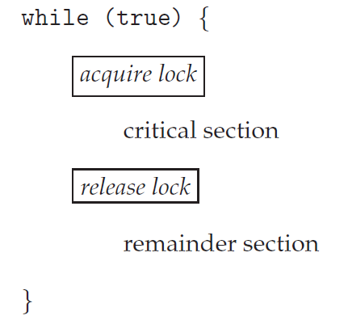
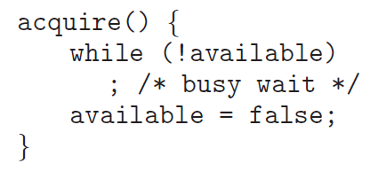
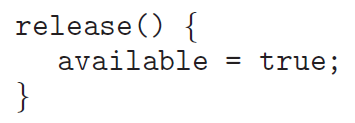
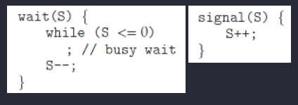
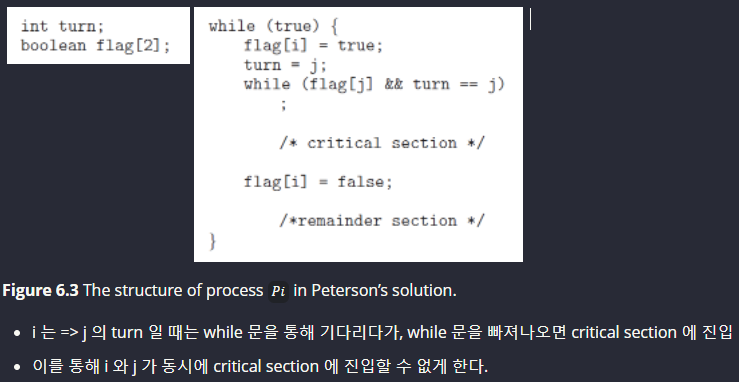

# CS study : 05 OS synchronization

> [Interview_Question_for_Beginner](https://github.com/JaeYeopHan/Interview_Question_for_Beginner)/**OS**/

- 위 repository 를 읽고 정리한 글입니다.

## 프로세스 동기화 Synchronization 

### Critical Section(임계영역)

동일한 자원을 동시에 접근하는 작업(e.g. 공유하는 변수 사용, 동일 파일을 사용하는 등)을 실행하는 코드 영역을 Critical Section 이라 칭한다.

-  share a **logical address space (thread)** or **data (shared memory, message passing)**

문제 

- **데이터 불일치(data inconsistency)** 를 불러올 수 있다.
  -  => 데이터 각각 올바르게 동작하는 두 개의 프로세스라도, concurrently (동시에) 실행되는 경우 올바르지 않은 결과를 불러온다. 

- 특히 **Race Condition** 에서 문제가 발생한다.  

  - data 를 공유하는 상황에서, 실행 결과가 process 혹은 thread 의 순서에 의존하는 경우.

  - 이를 방지하기 위해 **동기화(Synchronization)**가 필요한데, 이는 

    - 프로세스 간 공유하는 데이터는,
    - 한 번에 오직 하나의 프로세스 만이 조작 가능해야 함을 말한다. (***only one process at a time*** can manipulate the shared data)

    

### The Critical Section Problem 

임계 영역을 함께 사용할 수 있는 프로토콜 설계 방법 (동시에 두 프로세스가 임계 영역에서 실행되지 않도록 하는 방법을 고안)

Requirements(해결을 위한 기본조건)

- **Mutual Exclusion(상호 배제)**
  프로세스 P1 이 임계 영역에서 실행중이라면, 다른 프로세스들은 그들이 가진 임계 영역 에서 실행될 수 없다.

- **Progress(진행)**
  임계 영역에서 실행중인 프로세스가 없고, 임계 영역에 진입하고 싶은 프로세스가 있다면, 다음으로 임계 영역에 진입할 프로세스의 선택을 무한정으로 연기할 수 없다.  

  이는 **deadlock** (다음으로 critical section 에 진입하기 위해 대기 중인 process 중 아무도 진입하지 못하는 상황) 을 방지하기 위함이다. 

- **Bounded Waiting(한정된 대기)**
  P1 가 Critical Section 에 진입 신청 후 부터 받아들여질 때가지, 다른 프로세스들이 Critical Section 에 진입하는 횟수는 제한이 있어야 한다.

  이는 **starvation** 을 방지하기 위함이다. 

가장 단순한 해결책은, interrupt 를 막아 context switching 이 발생하지 않도록 한다. 이는 예측 불가능한 modification 은 없는 반면에, 시스템 성능이 매우 저하되므로 비현실적이다. 

### Synchronization Tools

**Higher-level software tools to solve the CSP : **

- ***Mutex Locks*** : the simplest tools for synchronization. => control 2
- ***Semaphore*** : more robust, convenient, and effective tool. => control N
- ***Monitor*** : mutex 와 semaphore 의 단점을 극복
- ***Liveness*** : Progress 조건을 만족하도록 보장하여 deadlock 해결 

#### Mutex Locks

mutex : 상호 배제 (***mut***ual ***ex***clusion) 기술, 임계 영역을 보호하고, race condition 을 방지한다. 

- 임계 영역에 진입하기 전에, 반드시 lock 을 획득해야 하고
- 임계 영역을 빠져나올 때 (exit), lock 을 방출해야 한다.

열쇠를 얻고 반납한다!!

이를 위해서 아래 세 가지 구현 사항이 필요하다. 

- `acquire()` and `release()`
- `available`

    

**한계**

- **Busy waiting** : `acquire()` 에서 while 문을 계속해서 돌기 때문에, CPU 를 잡아먹는다. (마치 공회전)
  - **Spinlock** : busy waiting 을 일으키는 mutext lock 
    - Spinlock 을 유용하게 쓰는 방법도 있다. 
      - 멀티코어 시스템인 경우, busy waiting 하던 thread 가 context switch 없이 바로 실행 가능 
      - 이는 wait queue, ready queue 를 거치는 시간이 없으므로 빠르다. 

#### Semaphores

semaphore : 신호장치, 신호기 

**정의**

semaphore `S` 는

- 정수 변수 (integer variable) 이며,
- 오직 `wait()` 과 `signal()` 이라는 두 개의 standard atomic operation 에 의해서만 접근 가능하다.   

- 현재 공유 데이터로 접근 가능한 출입문의 갯수라고 생각하면 쉽다.
  - 혹은 목욕탕 열쇠를 생각하면 쉽다..?

**종류**

- 이진 세마포 *Binary* Semaphore
  - range only between 0 and 1 => similar to *mutex lock*
  - S = 1 이면, 결국 mutex lock 과 동일하다. 
- 카운팅 세마포 *Counting* Semaphore
  - **가용한 개수를 가진 자원** (a finite number of instances) 에 대한 접근 제어용으로 사용되며, 세마포는 그 가용한 **자원의 개수** 로 초기화 된다. 자원을 사용하면 세마포가 감소, 방출하면 세마포가 증가 한다.
  - S = n (n > 1)

Counting Semaphore **순서** 

1. S를 사용 가능한 자원의 갯수로 초기화 시켜준다.
2. 프로세스가 자원을 사용할 경우
   - `wait()` 을 실행하여 현재 사용가능한 S의 갯수를 줄여준다.
3. 프로세스가 자원을 반납할 경우
   - `signal()`을 실행하여 현재 사용가능한 S의 갯수를 늘려준다.
4. S = 0 인 경우 (= 모든 리소스가 사용 중인 경우)
   - S가 0보다 커질 때 까지 `Busy wait`

**한계**

- Busy Waiting 
- Deadlock

#### Monitor 

semaphore 이후의 고수준  이자, 고급 언어의 설계 구조물로서, 개발자의 코드를 상호배제 하게끔 만든 **추상화된 데이터 형태**이다.

- 자원에 직접 접근이 어렵고, monitors 를 통해서만 접근할 수 있다. 
  - 공유자원 + 공유자원 접근함수로 구성
  - 2개의 queues: 배타동기(`Mutual exclusion queue`) + 조건동기(`Conditional synchronization`)
  - ex) Java Monitor
- 공유자원에 접근하기 위한 키 획득과 자원 사용 후 해제를 모두 처리한다. (세마포어는 직접 키 해제와 공유자원 접근 처리가 필요하다. )

위 방법들은 모두 Progress(진행) 과 bounded-waiting(유한 대기) 문제를 해결하지 못한다. 

#### Liveness

Progress와 bounded-waitiing 이 모두 만족하는 상황

저해 효소 

1. Deadlock
2. Starvation
3. Priority Inversion 

### etc

#### Peterson's Solution

mutual exclusion 을 보장하고, deadlock, starvation 을 방지하지만, machine language 단계에서의 오류 혹은 entry section 에서의 context switch 발생으로 인해 소수의 동기화 실패가 발생한다.  

#### Hardware Support for Synchronization 

instruction level 에서 원자성을 보존하기 어려우므로, Hardware 설계로 modify 또는 swap 동작을 하나의 회로로 one clock 에 해결할 수 있도록 하자.

