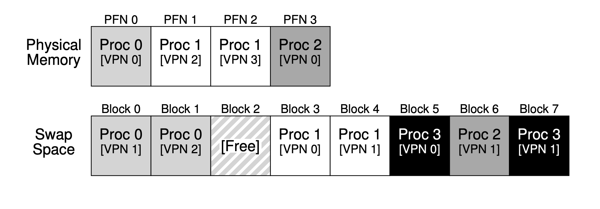
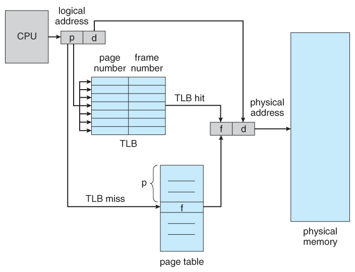

# 가상 메모리
# 물리 메모리 크기의 극복: 메커니즘

다수의 프로세스들이 동시에 각자 큰 주소 공간을 사용하고 있는 상황을 가정한다.

현재는 크게 필요하지 않은 일부를 보관해 둘 공간이 필요하다. 그 공간은 메모리 공간보다 더 크며, 더 느리다. 현대 시스템에서는 **하드 디스크 드라이브**가 이 역할을 담당한다.

### 물리 메모리 이상으로 나아가기 위해서 어떻게 할까

왜 프로세스에게 굳이 “큰” 주소 공간을 제공해야 하는가? `편리함`과 `사용 용이성`이다.

주소 공간이 충분히 크면, 프로그램의 자료 구조들을 위한 충분한 메모리 공간이 있는지 걱정하지 않아도 된다.

## 가상 메모리

스왑 공간이 추가되면 운영체제는 실행되는 각 프로세스들에게 큰 가상 메모리가 있는 것 같은 환상을 줄 수 있다. 멀티프로그래밍이 발명되면서 많은 프로세스들의 페이지를 물리 메모리에 전부 저장하는 것이 불가능하게 되었다. 그래서 일부 페이지들을 스왑 아웃하는 기능이 필요하게 되었다. 멀티프로그래밍과 사용 편의성 등의 이유로 `실제 물리 메모리보다 더 많은 용량의 메모리가 필요`하게 되었다. 이것이 가상 메모리의 역할이다.

# 스왑 공간

디스크에 페이지들을 저장할 수 있는 일정 공간을 확보해야 ⇒ **스왑 공간**

메모리 페이지를 읽어서 이곳에 쓰고, 여기서 페이지를 읽어 메모리에 탑재시킨다. 스왑 공간의 입출력 단위는 페이지. 운영체제는 스왑 공간에 있는 모든 페이지의 디스크 주소를 기억해야 한다.

스왑 공간의 크기는 매우 중요하다. 시스템이 사용할 수 있는 메모리 페이지의 최대수를 결정하기 때문이다.

일단 **스왑 공간의 크기가 매우 크다고 가정**해보자.

Proc 0, 1, 2가 물리 메모리를 공유하고 있다. 이 세 프로세스는 몇개의 유효한 페이지들만 메모리에 올려 놓았으며 나머지 페이지들은 디스크에 스왑 아웃 되어있다. Proc3의 모든 페이지들은 디스크로 스왑 아웃되어 있기 때문에 현재 실행중이 아닌 것을 알 수 있다. 

스왑 공간을 이용하면 시스템에 실제 물리적으로 존재하는 메모리 공간보다 더 많은 공간이 존재하는 것처럼 가장할 수 있다.

# Present Bit

페이지 스왑을 위한 기능

**하드웨어 기반의 TLB를 사용하는 시스템을 가정**하자.

present bit를 사용하여 각 페이지 테이블 항목에 어떤 페이지가 존재하는지를 표현한다.

Present bit

- 1: 해당 페이지가 존재
- 0: 메모리가 해당 페이지에 존재하지 않고 디스크 어딘가에 존재

`물리 메모리에 존재하지 않는 페이지를 접근하는 행위`를 일반적으로 **페이지 폴트**라고 한다.

페이지 폴트가 발생하면 이를 처리하기 위해 운영체제로 제어권이 넘어간다. **페이지 폴트 핸들러**가 실행된다.

# 페이지 폴트 Page fault

페이지 폴트가 발생하면 운영체제의 페이지 폴트 핸들러가 그 처리를 담당한다.

거의 대부분의 시스템들에서 페이지 폴트는 소프트웨어적으로 처리된다. 하드웨어 기반의 TLB도 페이지 폴트 처리는 운영체제가 담당한다.

**만약 요청된 페이지가 메모리에 없고, 디스크로 스왑 되었다면, 운영체제는 페이지 테이블 항목에서 해당 페이지의 디스크 상 위치를 파악하여 메모리로 탑재한다.** 

I/O 전송 중에는 해당 프로세스가 차단(blocked) 상태가 된다. 페이지 폴트 처리 시 운영체제는 다른 프로세스들을 실행할 수 있다. I/O 처리는 매우 시간이 많이 소요되기 때문에 한 프로세스의 I/O 작업(페이지 폴트)과 다른 프로세스의 실행을 중첩(overlap) 시키는 것은 멀티 프로그램된 시스템에서 하드웨어를 최대한 효율적으로 사용하는 방법 중 하나다.

# 메모리에 빈 공간이 없으면?

메모리에 여유 공간이 없거나 거의 다 찼을 수도 있다. 이 경우 탑재하고자 하는 새로운 페이지들을 위한 공간을 확보하기 위해 하나 또는 그 이상의 페이지들을 먼저 **페이지 아웃** 하려고 할 수 있다. **교체** 페이지를 선택하는 것을 **페이지 교체 정책**이라고 한다.

# 페이지 폴트의 처리

## 하드웨어 처리 과정

1. 페이지가 존재하며 유효한 경우
    - TLB 미스 핸들러가 PTE(Page Table Entry)에서 PFN(Page Frame Number)을 가져와서 명령어를 재시도한다. → 이때 TLB 히트가 된다.
2. 페이지가 유효하지만 존재하지 않는 경우
    - `페이지 폴트 핸들러`가 반드시 실행되어야 한다.
3. 페이지가 유효하지 않는 경우
    - 프로그램 버그 등으로 잘못된 주소를 접근하는 경우의 처리를 나타낸다.(트랩 핸들러)
    - 이때 문제를 일으킨 프로세스는 `종료`될 수 있다.

## 운영체제(소프트웨어) 처리 과정

1. 탑재할 페이지를 위한 물리 프레임을 확보한다.
2. 여유 프레임이 없다면, 교체 알고리즘을 실행하여 `메모리에서 페이지를 내보내고` 여유 공간을 확보한다.
3. 물리 프레임 확보 후, I/O 요청을 통해 스왑 영역에서 페이지를 읽어 온다.
4. 페이지 테이블을 갱신하고 명령어를 재시도한다.
5. 재시도 하면 TLB 미스가 발생하며, 또 한번의 재시도를 할 때에 TLB 히트가 된다.

# 교체는 실제 언제 일어나는가

이제까지의 설명은 메모리에 여유 공간이 고갈된 후에 교체 알고리즘이 작동하는 것을 가정하였다. 이 방법은 그리 효율적이지 않다.

메모리에 항상 어느 정도의 여유 공간을 비워두기 위해 대부분의 운영체제들은 여유공간에 관련된 최대값, 최소값을 설정하여 교체 알고리즘 작동에 활용한다.

### 동작방식

운영체제가 `여유 공간의 크기가 최솟값보다 작아지면` 여유 공간 확보를 담당하는 백그라운드 쓰레드가 실행된다. 이 쓰레드는 여유 공간의 크기가 최댓값에 이를 때까지 페이지를 제거한다. 이 백그라운드 쓰레드는 일반적으로 스왑 데몬 또는 페이지 데몬이라고 물린다. 충분한 여유 메모리가 확보되면 이 백그라운드 쓰레드는 슬립 모드로 들어간다.

일시에 여러 개를 교체하면 성능 개선이 가능하다. 예를 들어 많은 시스템들은 다수의 페이지들을 클러스터나 그룹으로 묶어서 한 번에 스왑 파티션에 저장함으로써 디스크의 효율을 높인다. 클러스터링은 디스크의 탐색과 회전 지연에 대한 오버헤드를 경감시켜 성능을 상당히 높일 수 있다.

백그라운드 페이징 쓰레드를 사용하기 위해서는 교체를 직접 수행하는 대신 사용할 수 있는 페이지들이 있는지 단순히 검사만 한다. 만약 없다면 백그라운드 페이징 쓰레드에게 여유 페이지들이 필요하다고 알려준다. 쓰레드가 페이지들을 비운 후에 원래의 쓰레드를 다시 깨워서 원하는 페이지를 불러들일 수 있도록 하며 계속 작업을 진행할 수 있도록 한다.

# 요약

present bit

페이지 폴트

페이지 폴트 핸들러

- 원하는 페이지를 디스크에서 메모리로 전송하기 위해 메모리의 일부 페이지들을 먼저 교체하여 새롭게 스왑돼서 들어올 페이지를 위한 공간을 만드는 조치를 취한다.

이 모든 작업은 프로세스가 인지하지 못하는 상황에서 처리된다는 것을 기억해야 한다.

프로세스가 보기에는 자신의 개별적인 연속된 가상 메모리를 접근하는 것처럼 보인다. 실제로 페이지들은 물리 메모리 임의의 위치에 배치되며, 때로는 디스크에서 가져와야 할 때도 있다.

# 물리 메모리 크기의 극복: 정책

빈 메모리 공간이 거의 없으면~ 운영체제는 메모리 압박을 해소하기 위해 다른 페이지들을 강제적으로 페이징 아웃하여 활발히 사용 중인 페이지들을 위한 공간을 확보한다,

내보낼(evict) 페이지 선택은 운영체제의 교체 정잭안에 집약되어 있다.

## 핵심 질문: 내보낼 페이지는 어떻게 결정하는가?

# 캐시 관리

캐시를 위한 교체 정책의 목표는 캐시 미스의 횟수를 최소화 하는 것이다. 캐시 히트 횟수를 최대로 하는 것도 목표라고 할 수 있다. 즉, 접근된 페이지가 메모리에 이미 존재하는 횟수를 최대로 하는 것이다.

평균 메모리 접근 시간(average memory access time, AMAT): 하드웨어 캐시의 성능을 측정할 때 사용하는 미터법

# 페이지 교체 정책(어떤 페이지를 OUT하느냐)

# 최적 교체 정책

미스를 최소화한다. 

가장 나중에 접근될 페이지를 교체하는 것이 최적이며, 가장 적은 횟수의 미스를 발생시킨다.

미래는 알 수 없기 때문에 범용 운영체제에서는 최적 기법의 구현은 불가능하다.

# 간단한 정책: FIFO

구현하기 매우 쉽다. 하지만 눈에 띄게 성능이 안 좋다.

# 또 다른 간단한 정책: 무작위 선택

운에 전적으로 의존하기 때문에 성능은 그때그때 달라진다.

# 과거 정보의 사용: LFU, LRU

어떤 프로그램이 가까운 과거에 한 페이지를 접근했다면 가까운 미래에 그 페이지를 다시 접근하게 될 확률이 높다.

페이지 교체 정책이 활용할 수 있는 과거 정보

- 빈도수 (frequency)
- 최근성 (recency)

⇒ 지역성의 원칙

**LFU (Least-Frequently-Used)**: 가장 적은 빈도로 사용된 페이지를 교체한다.

**LRU (Least-Recently-Used)**: 가장 오래 전에 사용했던 페이지를 교체한다.

# 페이지 선택 정책 (어떤 페이지를 IN하느냐)

## 요구 페이징

페이지가 실제로 접근될 때 운영체제가 해당 페이지를 메모리로 읽어 들인다(선반입).

성공할 확률이 충분히 높을 때에만 해야한다.

## 클러스터링

기록해야 할 페이지들을 메모리에 모은 후, 한번에 디스크에 기록한다.