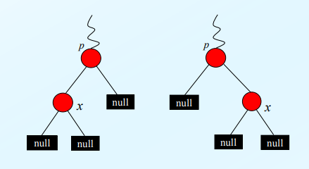

CS study : Binary Heap

>[Interview_Question_for_Beginner](https://github.com/JaeYeopHan/Interview_Question_for_Beginner)/**DataStructure**/

- 위 repository 를 읽고 정리한 글입니다. 

## ADT Priority Queue

- 3가지 동작이 가능한 Queue

1. `insertion`

2. `deletion`, `retrieval` of max element

- `array`, `linked list`, `search tree`, `heap` 을 통해 구현 가능하다. 

## Binary Heap

### 정의

트리 구조

- 그 중에서도 배열로 표현가능한 `완전 이진 트리(Complete Binary Tree)` 이며, 
  - 완전 이진 트리는, 루트로부터 시작해서 가능한 지점까지 모든 노드가 정확히 두 개씩의 자식 노드를 가지며, 노드의 수가 부족해 `포화 이진 트리(Full Binary Tree)`가 안되는 경우엔, 맨 마지막 레벨은 왼쪽부터 채워나간다.  

`힙(Heap)` 에는 `최대힙 (Max Heap)` 과 `최소힙(Min Heap)` 두 종류가 있다. 

- 최대힙은, 각 노드의 값이 해당 노드의 자식 노드의 값보다 크거나 같다. 
  - 최대힙에선, 루트 노드에 있는 값이 가장 크므로, 최댓값을 찾는데 소요되는 연산의 시간 복잡도가 `O(1)` 이다.
- 최소힙은, 각 노드의 값이 해당 노드의 자식 노드의 값보다 작거나 같다. 

완전 이진 트리는 배열로 표현 가능하므로 인덱스가 `i` 인 노드의 

- 자식은 `2i + 1`, `2i + 2` 에 존재하고, 
- 부모는 `(i - 1) // 2` 에 존재한다. 

만약 배열의 0번 인덱스를 건너뛰고, 1번 자리부터 사용하면, 자식은 `2i`, `2i + 1` 부모는 `i//2` 번째에 존재한다. 

>정리하면.. 
>
>1. 완전 이진 트리 구조를 가지며, 최대힙과 최소힙으로 나눌 수 있다. 
>2. 최대힙은 각 노드의 값이 해당 노드의 자식 노드 값보다 크거나 같고, 따라서 루트 노드의 값이 가장 크다. 
>3. 따라서 최댓값 혹은 최솟값을 찾는 연산의 시간 복잡도가 `O(1)` 이므로, 우선 순위 큐 구현에 사용하면 효율적이다. 

### Heap 객체 구현

- 필드 

  - `A[]` : heap 원소들이 저장되는 배열 
  - `numItems` : heap 에 있는 원소의 총 수 

- 작업

  - `insert(x)` : heap 에 원소 x 를 삽입한다. 
  - `deleteMax()` : heap 의 최대 원소를 알려주면서 삭제한다. 
  - `max()` heap 의 최대 원소를 알려준다. 
  - `buildHeap()` : 배열 A[] 를 heap 으로 만든다. 
  - `isEmpty()` : heap 이 빈 heap 인지 알려준다. 
  - `clear()` : heap 을 깨끗이 청소한다. (비운다)

  

#### Deletion

1. Return the root item 
2. Remove the last node and move it to the root 
3. Percolate down until the heap is valid 

수행 시간은 최악의 경우 `θ(logn)` , 최선의 경우 `θ(1)` 

#### Insertion 

1. Insert an item into the bottom of the complete tree
2. Percolate up until the heap is valid 

수행 시간은 최악의 경우 `θ(logn)` , 최선의 경우 `θ(1)` 

#### buildHeap 

임의의 배열이 주어진 상황에서, 맨 마지막 노드의 parent 부터 시작하여, 그 앞의 약 `n/2` 개의 노드에 대해 교환을 시도한다. 

수행시간 `θ(n)` 

### Heap sort

임의의 배열을 `buildHeap` 을 통해 힙 자료구조로 만든 뒤, `deletion` 작업을 수행하며 얻은 최댓값을 다시 배열에 차례대로 집어 넣는다. 

수행시간은 `O(nlogn)`, 최악의 경우 `θ(nlogn)`

## Red Black Tree 

### 정의

Balanced Binary Search Tree 로, AVL Tree 와 함께, `search`, `insertion`, `deletion` 에 `O(nlogn)` 의 시간복잡도를 보장한다. 

Binary Search Tree 는 같은 데이터를 가지고도, 다른 형태의 트리 모양을 가질 수 있는데, 한 쪽으로 치우친 편향 트리의 경우엔 성능이 좋지 않다. 

따라서 모양을 compact 하게 구성하여 효율적인 트리를 구성해야 하는데, 이를 적용한 것이 Balanced Binary Search Tree 이다.  

아래의 성질을 만족한다. 

1. 모든 null 자리에 리프 노드를 두며, RB-Tree에서 리프 노드는 이 null 리프 를 말한다
2. 모든 노드는 `red` 또는 `black`이라는 색깔을 갖는다.
3. Root node 의 색깔은 `black`이다.
4. 각 leaf node 는 `black`이다.
5. 어떤 노드의 색깔이 `red`라면 두 개의 children 의 색깔은 모두 black 이다.
   - 즉, 루트로부터 임의의 리프 노드에 이르는 경로 상에 `red` 노드 두 개가 연속해서 출현하지 못한다. 
6. 루트 노드에서 임의의 리프 노드에 이르는 경로에서 만나는 `black` 노드의 수는 모두 같다. 이를 해당 노드의 `Black-Height`라고 한다.

Java Collection 에서 TreeMap 도 내부적으로 RBT 로 이루어져 있고, HashMap 에서의 `Separate Chaining`에서도 사용된다. 그만큼 효율이 좋고 중요한 자료구조이다.

### 구현

#### Insertion 

일반적인 BST 의 삽입 작업을 수행하고, 삽입한 노드에 `red` 를 칠하고, 삽입한 노드의 좌우에 null 리프를 달아준다. 

1. 삽입한 노드의 부모 노드가 `black` 인 경우 

   - 수선이 필요하지 않다. 

2. 삽입한 노드의 부모 노드가 `red` 인 경우

   - 수선이 필요 

    

#### Rebalancing

정의에서 살펴본 5, 6번 성질을 만족하도록 수선 필요. 

